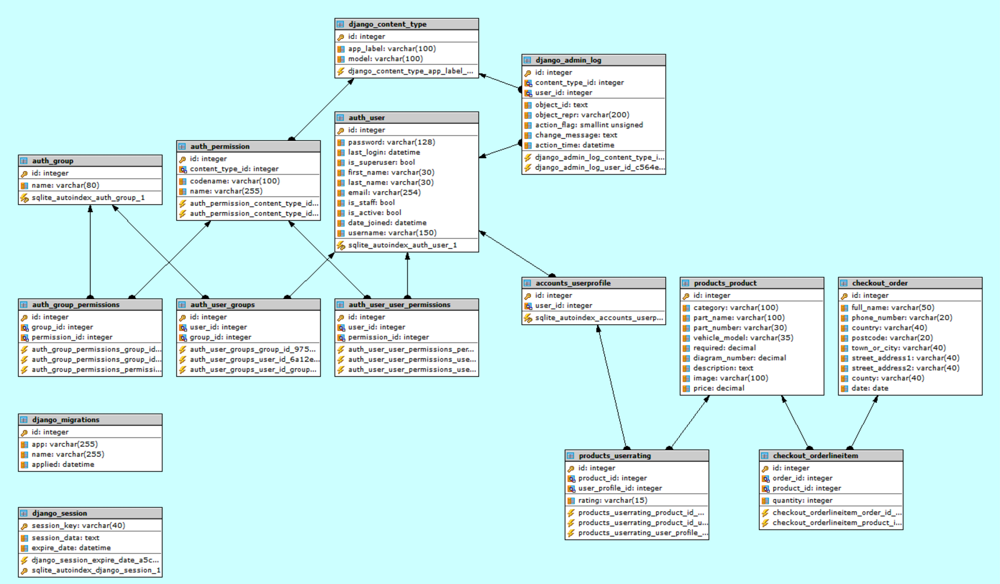
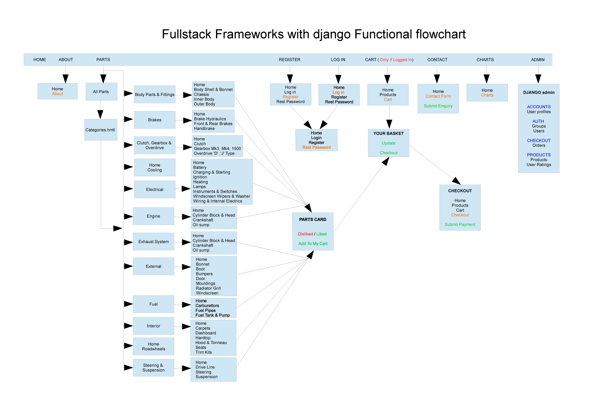

[](https://travis-ci.org/bennettpe/fullstack-frameworks-django-website)

# Full Stack Frameworks with Django Milestone 5 Project

## eCommerce Webshop
Heroku App: https://fullstack-frameworks-project.herokuapp.com <br>
Heroku git: https://git.heroku.com/fullstack-frameworks-project.git <br>
GitHub: https://github.com/bennettpe/fullstack-frameworks-django-website.git <br>

This is the milestone project that I have created for the **“Full Stack Frameworks with Django”** module, which is part of  “Full Stack Web Development Course” offered by Code Institute.

## Project Brief
This project will be built using knowledge which has been learnt within the "Full Stack Frameworks with Django module" and the other eight previous modules.

For project brief see [Project Brief documentation](static/wireframe/My_Full_Stack_Frameworks_with_Django_Project_Brief.pdf) <br>

### My Project Overview
A web application for classic car parts , parts for the webshop have been gathered from the following website [**scparts.co.uk**](https://www.scparts.co.uk/sc_en/british-cars/triumph/triumph-spitfire-mkiii-mkiv-and-1500-1967-1980.html)

* The user has a choice to do the following  
  * Register an account with a username and password
  * Log-in with a registered username and password
  * Reset password with a registered username
  * Search products (by 12 parts categories)
  * View parts by parts diagrams
  * Add products to shopping cart
  * Adjust quantity of parts in shopping cart
  * Pay for products in shopping cart checkout 
  * Vote to like / dislike products
  * Contact us via contact page
  * View websits satistics charts 

## UX  

### Who is this website for ?  
* A website that allows users to view and purchase classic car parts.

### What is it they want to achieve ?
To provide a online eCommerce wbsite that users must be able to do the following
    
* Add products to use Stripe shopping cart checkout (only if Logged in).
* Adjust quantity in Shopping cart
* Add User via registration and authentication processes.
* Users to vote to like or diskliked products.
* View website graphs
* Contact us via contact page
* Ensure there's a README.md.

### How the project is best way to achieve these things ? 
* Create Web Application (Create New Ecommerce multi app Django web application.)
* Include Ecommerce functionality (Create app(s) to use Stripe (Shopping cart checkout)
* Include Form validation (Create form(s) to allow users to Create / Edit models in backend)
* Include Graphs (Create graphs for website satistics)
* Include Up / Down voting (Users could upvote/downvote i.e. parts they like/dislike)
* Include Version Control (Use Git & GitHub)
* Test code (Make sure code is extensively tested and documented in READMe.md)
* Backend Logic (Create backend to include (whenever relevant) third-party Django / Python framework)
* Database connection (Connect DB using Django Object-Relational Mapper (ORM)
* Frontend Logic (Create frontend to include JavaScript logic)
* User Interface (UI) (Create UI to include Bootstrap or media queries)
* Deploy Final Version (Use Heroku as hosting platform)
* Ensure there’s a README.md (A project submitted without a README.md file will FAIL)

### Project Planning & Wireframe Mockup 
For planning see [Planning documentation](static/wireframe/My_Full_Stack_Frameworks_with_Django_Milestone_Project_Planning.pdf) <br>
For wireframe see [Wireframe documentation](static/wireframe/My_Full_Stack_Frameworks_with_Django_Wireframe.pdf)

### Database Schema
My SQLite3 (Development) / Postgres (Production) database consists of the following tables
* accounts_userprofile
* checkout_order
* checkout_orderlineitem
* products_product
* products_userating

   
Diagram of website database schema


### Functional Flow    
On the **navbar** there are the following eight icons (**Home**, **About**, **Parts**, **Register**, **Log in**, **Cart**, **Contact**, **Charts**) <br> and on the page there are **Register** and **log in** buttons.    
Unregistered users can search parts by, clicking on parts which then shows a parts category dropdown. <br>
The **Register** button allows uses to register username and password.   
The **sign in** button allows users to sign in.
once signed in the login and register icon are removed and a Log out icon is shown with userid. <br>
When **logging out** a message is displayed saying **You have successfully been logged out**. <br>
When **logging in** as **admin** a icon is shown on the navbar to access the django admin panel.

   
Diagram of website functional flow  

### Technologies
<details>
<summary>
Technologies Used in this project 
</summary>
<p>
    
   
Technologies used in the construction of this project include,  
* [Badel](https://pypi.org/project/Babel/) is a collection of tools for internationalizing Python applications.
* [Bootstrap](https://getbootstrap.com/) is a framework for building responsive, mobile-first websites.
* [Bootstrap-Magnify](https://github.com/marcaube/bootstrap-magnify) is a small js plugin to enhance porte-folios and image galleries.
* [Bootswatch](https://bootswatch.com/sandstone/) is a free bootstrap theme.
* [Boto3](https://pypi.org/project/boto3/) is a software development kit (SDK) designed to improve the use of the Python programming language in AWS.
* [Botocore](https://pypi.org/project/botocore/) is a Low-level, data-driven core of boto 3.
* [Certifi](https://pypi.org/project/certifi/) is a Python package for providing Mozilla's CA Bundle.
* [Chardet](https://pypi.org/project/chardet/) is a Universal encoding detector for Python 2 and 3
* [Chrome Developer Tools]() is a set of web developer tools built directly into the Google Chrome browser.
* [Cloud9 IDE](https://aws.amazon.com/cloud9/) is a cloud-based integrated development environment (IDE) used as development environment workspace.
* [CSS3](https://www.w3.org/Style/CSS/Overview.en.html) is a simple mechanism for adding style (e.g., fonts, colors, spacing) to Web documents.
* [Docutils](https://pypi.org/project/docutils/) is a Python Documentation Utilities
* [Django](https://www.djangoproject.com/download/) is a Python-based open-source web framework, which follows the model-template-view architectural pattern.
* [Django-Forms-Bootstrap](https://github.com/pinax/django-forms-bootstrap) is a simple bootstrap filter for Django forms.
* [Django-Storages](https://pypi.org/project/django-storages/) is a collection of custom storage backends for Django.
* [Django-Phonenumber-Field](https://pypi.org/project/django-phonenumber-field/) is a Django library which interfaces with phonenumbers to validate, convert phone nums.
* [Phonenumbers](https://github.com/daviddrysdale/python-phonenumbers) is a Python port of Google's libphonenumber library 
* [Dj-database-url](https://pypi.org/project/dj-database-url/) is a Django utility to utilize the 12factor inspired DATABASE_URL env va to configure your Django app.
* [Font Awesome](https://fontawesome.com/) is a font and icon toolkit.
* [Git](https://git-scm.com/) open source distributed version control system.
* [GitHub](https://github.com/) is a Web-based hosting service for version control using Git.
* [GitIgnore](https://www.gitignore.io/) is a web service designed to help you create .gitignore files for your Git repositories.
* [Gunicorn]() is a Python WSGI HTTP Server for UNIX.
* [Heroku](https://www.heroku.com/) lets you deploy, run and manage applications written in Ruby, Node.js, Java, Python, Clojure, Scala, Go and PHP.
* [Highcharts](https://www.highcharts.com/) is a software library for charting written in pure JavaScript.
* [HTML5](https://www.w3.org/TR/html52/): is code that describes web pages.
* [Idna](https://pypi.org/project/idna/) is a Internationalized Domain Names in Applications (IDNA)
* [JavaScript](https://www.javascript.com/) JavaScript is a dynamic computer programming language. And most commonly used as a part of web pages.
* [Jinga2](http://jinja.pocoo.org/) a full featured template engine for Python.
* [Jmespath](http://jmespath.org/) is a query language for JSON.
* [Pencil](https://pencil.evolus.vn/) is an open-source GUI prototyping tool used to create Wireframe mockup.
* [Pillow](https://pypi.org/project/Pillow/) is a Pillow is the friendly PIL fork.
* [Psycopg2](http://initd.org/psycopg/) is a popular PostgreSQL adapter for the Python. 
* [Python 3.4.3](https://www.python.org/) is a scripting language.
* [Pytz](https://pypi.org/project/pytz/) is a World timezone definitions, modern and historical.
* [Requests]() is a Python HTTP for Humans.
* [S3transfer](https://pypi.org/project/s3transfer/) is a An Amazon S3 Transfer Manager
* [Slack](https://code-institute-room.slack.com/messages) is a collaboration hub that connects your organization.
* [Python-dateutil]() is a Extensions to the standard Python datetime module.
* [Sqlite3](https://www.sqlite.org/index.html) is a C-language library that implements a SQL database engine.
* [SQLite Maestro](https://www.sqlmaestro.com/products/sqlite/maestro/) is a admin tool for database management, control and development. 
* [Sql Postgres](https://www.postgresql.org/)is a powerful, open source object-relational database system
* [Stripe](https://stripe.com/gb) is a powerful and flexible tools for internet commerce.
* [Travis](https://travis-ci.com/) is a hosted continuous integration service used to build and test software projects hosted at GitHub.
* [Urllib3](https://pypi.org/project/urllib3/) is a HTTP library with thread-safe connection pooling, file post, and more.
</details>
    
## Setting up Project Enviroment
<details>
<summary>
Step 01 - Django Product Enviroment
</summary>
<p>

## Git
Make sure once the workspace has been created in Cloud9 you create the following for git by typing the following commands,  
* `git init` to create a empty Git repository. <br>
* Create `.gitignore` which specifies intentionally untracked files to ignore <br>
* Add to `.gitignore` file the ignore file(s) for the environments you are using in your workspace i.e. `Cloud9`, `Django`, `Python` by copying ignore files from [GitIgnore](https://www.gitignore.io/) <br>
* Also make sure you add your own personal non environmental file you would like to be excluded as well at the top of the file.

## Step1 Create Django Project Enviroment
1. Create the project Clould9 Workspace **fullstack-frameworks-django-project** <br>

2. Install Django 1.11.20 <br>
    ```python 
    sudo pip3 install django==1.11.20 
    ``` 
    This installs **django 1.11.20** and **pytz 2018.9** 
    
    output from bash terminal 
    ```bash
    bennettpe:~/workspace $ sudo pip3 install django==1.11.20
    Downloading/unpacking django==1.11.20
    Downloading Django-1.11.20-py2.py3-none-any.whl (6.9MB): 6.9MB downloaded
    Downloading/unpacking pytz (from django==1.11.20)
    Downloading pytz-2018.9-py2.py3-none-any.whl (510kB): 510kB downloaded
    Installing collected packages: django, pytz
    Successfully installed django pytz
    Cleaning up...
    ```

3. Initalise Git repository <br>
    ```python
    git init
    ```
    output from bash terminal
    ```bash
    bennettpe:~/workspace $ git init
    Initialized empty Git repository in /home/ubuntu/workspace/.git/
    ```
    
4. Create `.gitignore` and `README.md` files 

5. Create `requirements.txt` file <br>
   ```bash
   sudo pip freeze --local > requirements.txt
   ```
   output from bash terminal
   ```bash
   bennettpe:~/workspace (master) $ sudo pip freeze --local > requirements.txt
   ```
6. Go to Github https://github.com and Create new repository called `fullstack-frameworks-django-website` <br>
   output from bash terminal
   ```bash
   bennettpe:~/workspace (master) $ git add .
   bennettpe:~/workspace (master) $ git commit -m "first commit"
   [master (root-commit) 7fd944a] first commit
    4 files changed, 71 insertions(+)
    create mode 100644 .gitignore
    create mode 100644 README.md
    create mode 100644 WORKING.md
    create mode 100644 requirements.txt
   bennettpe:~/workspace (master) $ git remote add origin https://github.com/bennettpe/fullstack-frameworks-django-website.git
   bennettpe:~/workspace (master) $ git push -u origin master
   Username for 'https://github.com': bennettpe
   Password for 'https://bennettpe@github.com': 
   Counting objects: 5, done.
   Delta compression using up to 8 threads.
   Compressing objects: 100% (4/4), done.
   Writing objects: 100% (5/5), 1.40 KiB | 1.40 MiB/s, done.
   Total 5 (delta 0), reused 0 (delta 0)
   To https://github.com/bennettpe/fullstack-frameworks-django-website.git
    * [new branch]      master -> master
   Branch master set up to track remote branch master from origin.
   ```
   Heroku Git URL https://git.heroku.com/fullstack-frameworks-project.git

7. Go to Heroku https://dashboard.heroku.com/apps and <br> Create new app called `fullstack-frameworks-project` <br>
   Click on `Create New App` fill in `App name`   
   Click on `Choose a region` and select `Europe`   
   Click on `Create app` button

8. Install Gunicorn
   ```python
   sudo pip3 install gunicorn
   ```
   This installs **gunicorn 19.9.0** 
   
   output from bash terminal
   ```bash
   bennettpe:~/workspace (master) $ sudo pip3 install gunicorn
   Downloading/unpacking gunicorn
   Downloading gunicorn-19.9.0-py2.py3-none-any.whl (112kB): 112kB downloaded
   Installing collected packages: gunicorn
   Successfully installed gunicorn
   Cleaning up...
   ```

9. Install Psycopg2
   ```python
   sudo pip3 install psycopg2
   ```
   This installs **psycopg2 2.8**  

   output from bash terminal
   ```bash
   bennettpe:~/workspace (master) $ sudo pip3 install psycopg2
   Downloading/unpacking psycopg2
   Downloading psycopg2-2.8.tar.gz (367kB): 367kB downloaded
   Running setup.py (path:/tmp/pip_build_root/psycopg2/setup.py) egg_info for package psycopg2
     /usr/lib/python3.4/distutils/dist.py:260: UserWarning: Unknown distribution option: 'project_urls'
       warnings.warn(msg)
     /usr/lib/python3.4/distutils/dist.py:260: UserWarning: Unknown distribution option: 'python_requires'
       warnings.warn(msg)
    
   Installing collected packages: psycopg2
   Running setup.py install for psycopg2
     building 'psycopg2._psycopg' extension
     
   ....    
   Successfully installed psycopg2
   Cleaning up...    
   ```
10.  Create `requirements.txt` file <br>
   ```bash
   sudo pip freeze --local > requirements.txt
   ```
   output from bash terminal
   ```bash
   bennettpe:~/workspace (master) $ sudo pip freeze --local > requirements.txt
   ``` 

11. Create a new PostgreSQL database on Heroku
    Click on `Resources`   
    Scroll down to `Add-ons` type `Postgres` <br> select `Heroku Postgres` <br> select `Hobby Dev - Free plan` <br> click on `Provision` button <br>
    This creates a empty database

12. Install dj-database-url
    ```python
    sudo pip3 install dj-database-url
    ```
    This installs **dj-database-url 0.5.0** 

    ouput from bash terminal
    ```bash
    bennettpe:~/workspace (master) $ sudo pip3 install dj-database-url
    Downloading/unpacking dj-database-url
    Downloading dj_database_url-0.5.0-py2.py3-none-any.whl
    Installing collected packages: dj-database-url
    Successfully installed dj-database-url
    Cleaning up...
    ```

13. Create Django project called `Triumphant-Triumphs` in the root directory by adding .
    ```python
    django-admin startproject triumphant_triumphs .
    ```
 
     ouput from bash terminal
    ```bash
    bennettpe:~/workspace (master) $ django-admin startproject triumphant_triumphs .  
    ```
    
    The following django files have been created
    ```
    fullstack-frameworks-django-project
    │
    ├── triumphant_triumphs
    │   │
    │   ├── __init__.py   # An empty file that tells Python that this directory should be considered a Python package. 
    │   ├── settings.py   # Settings/configuration for this Django project.
    │   ├── urls.py       # The URL declarations for this Django project; a “table of contents” of your Django-powered site.
    │   └── wsgi.py       # An entry-point for WSGI-compatible web servers to serve your project.
    │
    └── manage.py         # A command-line utility that lets you interact with this Django project in various ways.
    ```

14. Open `settings.py` and add the following to `ALLOWED_HOSTS` to allow Cloud9 as allowed host
    ```python
    ALLOWED_HOSTS = [os.environ.get('C9_HOSTNAME')]
    ```

15. Run the following command to check running server is ok
    ``` 
    python3 manage.py runserver SIP:$C9_PORT
    ```

    output from bash terminal
    ```bash 
    bennettpe:~/workspace (master) $ python3 manage.py runserver $IP:$C9_PORT
    Performing system checks...

    System check identified no issues (0 silenced).

    You have 13 unapplied migration(s). Your project may not work properly until you apply the migrations for app(s): admin, auth, contenttypes, sessions.
    Run 'python manage.py migrate' to apply them.

    April 06, 2019 - 08:18:51
    Django version 1.11.20, using settings 'triumphant_triumphs.settings'
    Starting development server at http://0.0.0.0:8080/
    Quit the server with CONTROL-C.
    ```
    
    Click on link `your code is running at  https://fullstack-frameworks-django-project-bennettpe.c9users.io`
    and you see the following 
    ```bash
    It worked!
    Congratulations on your first Django-powered page.
    Next, start your first app by running python manage.py startapp [app_label].

    You're seeing this message because you have DEBUG = True in your Django settings file and you haven't configured any URLs. Get to work!
    ```
    
    output from bash terminal
    ```bash
    Not Found: /favicon.ico
    [06/Apr/2019 08:21:15] "GET /favicon.ico HTTP/1.1" 404 2017
    [06/Apr/2019 08:21:17] "GET / HTTP/1.1" 200 1716
    ```
16. Click on COG in workspace and click on `Show home in Favourites` 
    In workspace folder open up `.bash_aliases` file and add the following new alias to the bottom of the file.
    ```python
    alias run="python3 ~/workspace/manage.py runserver $IP:$C9_PORT"
    ```
    Close the bash terminal and reopen it to make the alias avaliable or Type `. ~/.bash_aliases`
    Type `run` to look at app.

17. Add `*.sqlite3 .~c9*files` files to ignore in `.gitignore`

18. Run `git status` to check which files will be added and commited to Git. 

19. Run the following command to initialize our databases and get table ready.
    ```python
    python3 manage.py migrate
    ```
    
    output from bash terminal
    ```bash
    bennettpe:~/workspace (master) $ python3 manage.py migrate
    Operations to perform:
    Apply all migrations: admin, auth, contenttypes, sessions
    Running migrations:
    Applying contenttypes.0001_initial... OK
    Applying auth.0001_initial... OK
    Applying admin.0001_initial... OK
    Applying admin.0002_logentry_remove_auto_add... OK
    Applying contenttypes.0002_remove_content_type_name... OK
    Applying auth.0002_alter_permission_name_max_length... OK
    Applying auth.0003_alter_user_email_max_length... OK
    Applying auth.0004_alter_user_username_opts... OK
    Applying auth.0005_alter_user_last_login_null... OK
    Applying auth.0006_require_contenttypes_0002... OK
    Applying auth.0007_alter_validators_add_error_messages... OK
    Applying auth.0008_alter_user_username_max_length... OK
    Applying sessions.0001_initial... OK
    ```

20. Run the following commands to Commit changes to git.
    ```python
    git add .
    git commit -m "git commit -m "Initial commit for django project"
    ```

    output from bash terminal
    ```bash
    [master 5dfdc88] Initial commit for django project
    8 files changed, 392 insertions(+), 4 deletions(-)
    create mode 100755 manage.py
    create mode 100644 triumphant_triumphs/__init__.py
    create mode 100644 triumphant_triumphs/settings.py
    create mode 100644 triumphant_triumphs/urls.py
    create mode 100644 triumphant_triumphs/wsgi.py
    ```
</details>

<details>
<summary>
Step 02 - AUTHENTICATION App
</summary>
<p>
    
## Step2 Authentication App - Authentication and Authorisation 

This section is for setting up an **authentication mechanism** to allow users to register and log in.

1. **Create** Django app called **account** 
    ```python
    django-admin startproject accounts
    ```
 
     ouput from bash terminal
    ```bash
    bennettpe:~/workspace (master) $ django-admin startapp accounts 
    ```
    
    The following django files have been **created**
    ```
    fullstack-frameworks-django-project
    │
    └── accounts
        ├── migrations
        │   └── __init__.py # Python file to allow app packages to be imported from other directories.  
        │
        ├── __init__.py     # Python file to allow app packages to be imported from other directories. 
        ├── admin.py        # File with admin definitions for the app. 
        ├── apps.py         # File with configuration parameters for the app.
        ├── models.py       # File with database definitions (i.e., model classes) for the app.
        ├── tests.py        # File with test definitions for the app.
        └── views.py        # File with view definitions (i.e., controller methods) for the app.
    ```    
2. In **setting.py** 
   go to **INSTALLED_APPS** section and add line containing **accounts** 
   ```python
   # Application definition

   INSTALLED_APPS = [
    'django.contrib.admin',
    'django.contrib.auth',
    'django.contrib.contenttypes',
    'django.contrib.sessions',
    'django.contrib.messages',
    'django.contrib.staticfiles',
    'accounts',                   <== this line added.
    ]
   ```

3. **Create** admin superuser
   ```python
   python3 manage.py createsuperuser
   ```

   ouput from bash terminal
   ```bash
   bennettpe:~/workspace (master) $ python3 manage.py createsuperuser
   Username (leave blank to use 'ubuntu'): admin
   Email address: admin@gmail.com
   Password: 
   Password (again): 
   Superuser created successfully.
   ```
   
4. Log into Django admin 
   **Go to** https://fullstack-frameworks-django-project-bennettpe.c9users.io/admin <br>
   Enter **Username** and **Password** created in admin superuser. <br>
   Your now have access to the Django admin panel.

5. Create a **templates** folder in the **accounts** app <br>
   Create a new file called **index.html**
   ```html
   <!DOCTYPE html>
    <html>
        <head>
            <title> Django Auth </title>
        </head>
        <body>
            <nav>
               <ul>
                <li> <a href="#"> Login </a></li>
                <li> <a href="#"> Logout </a></li>
                <li> <a href="#"> Register </a></li>
                <li> <a href="#"> Profile </a></li>
               </ul>
            </nav>
        </body>
     </html>
   ```

6. Create a view function called **index** in **views.py**
   ```python
   def index(request):
    """Return the index.html file"""
    return render(request, 'index.html')
   ```

7. Create a url pattern in **triumphant_triumphs/urls.py**
   ```python
   from accounts.views import index   
   url(r'^$', index),
   ```

8. Linking hrefs to URLs
   update file called **index.html**
   ```python
    <li> <a href="#"> Logout </a></li>
   ```
   change to
   ```python
    <li> <a href=""> Logout </a></li>
   ```

9. Create a view function called **logout** in **views.py**
   ```python
   from django.shortcuts import render, redirect, reverse <== add redirect, reverse
   from django.contrib import auth                        <== add this line
   # The 'logout' view allows users to logout
     def logout(request):
     """Log the user out"""
     auth.logout(request)
     return redirect(reverse('index'))
   ```

10. Create a url pattern in **triumphant_triumphs/urls.py**
    ```python
    from accounts.views import index, logout <== add logout
    url(r'^accounts/logout/$', logout, name="logout")
    ```
    
    amend
    ```python
    url(r'^$', index),               <== change from 
    url(r'^$', index, name="index"), <== change to
    ``` 

11. Add Django messages 
    in **accounts/views.py**
    amend
    ```python
    from django.contrib import auth            <== change from
    from django.contrib import auth, messages  <== change to
    ```
    add
    ```python
     messages.success(request, "You have successfully been logged out!")
    ```

    in **accounts/templates/index.html**
    add
    ```html
    
    <div>
         
             {{ messages }}
         
    </div>
        
    ```
    
    Update **settings.py** file
    ```python
    MESSAGE_STORAGE ="django.contrib.messages.storage.session.SessionStroage"
    ```

12. Create a view function called **login** in **accounts/views.py**
    ```python
    # The 'logoin' view allows users to login 
    def login(request):
    """Log the user in"""
    return render(request, 'login.html')
    ```

13. Linking hrefs to URLs
    update **accounts/template/index.html**
    ```python
     <li> <a href="#"> Logoin </a></li>                   <== change from
     <li> <a href=""> Logoin </a></li>  <== change to
    ```

14. Copy contents of **accounts/templates/index.html**   
    Create           **accounts/templates/login.html**   
    Amend H1 heading to `User Login`

15. Create a url pattern in **triumphant_triumphs/urls.py**
    ```python
    from accounts.views import index, logout, login <== add login
    url(r'^accounts/login/$', login, name="login")
    ```

16. Create login form in **accounts**
    ```python
    from django import forms

    class UserLoginForm(forms.Form):
    """Form to be used to log users in """
    
    username = forms.CharField()
    password = forms.CharField(widget=forms.PasswordInput)
    ```

17. Update **accounts/view.py**
    Add 
    ```python
    from accounts.forms import UserLoginForm
    ```
    Amend in view function called **login**
    ```python
     login_form = UserLoginForm() <== add this line
     return render(request, 'login.html') <== change from 
     return render(request, 'login.html', {"login_form": login_form}) <== change to
    ```
  
18. Update **accounts/templates/login.html
    Add
    ```python
    <form method="POST">
            
            {{ login_form.as_p }}
            <button type="submit"> Login </button>
        </form> 
        
        
            <div>
                
                    {{ message }}
                
            </div>
        
    ```

19. Backend logic to authenticate user in **accounts/views.py**
    Add
    ```python
    # The 'logoin' view allows users to login 
    def login(request):
    """Log the user in"""
    if request.method == "POST":
        login_form = UserLoginForm(request.POST)
        
        if login_form.is_valid():
            user = auth.authenticate(username=request.POST['username'],
                                     password=request.POST['password'])
            if user:
                auth.login(user=user, request=request)
                messages.success(request, "You have successfully logged in!") 
            else:
                login_form.add_error(None, "Your username or password is incorrect")
                
    else:
        login_form = UserLoginForm()
    return render(request, 'login.html', {"login_form": login_form})
    ```

20. Apply template inheritance
    Create **template** folder in fullstack-frameworks_dgango-project
    Create **base.html** file  in fullstack-frameworks-django-project/templates
    ```html
    <!DOCTYPE html>
    <html>
    <head>
        <title>   </title>
    </head>
    
    <body>
        <h1>   </h1>
        <nav>
            <ul>
              <li> <a href="" > Login </a></li>
              <li> <a href=""> Logout </a></li>
              <li> <a href="#"> Register </a></li>
              <li> <a href="#"> Profile </a></li>
            </ul>
        </nav>
        <hr>
        
        <div>
            
                {{ messages }}
            
        </div>
            
             
    </body>
    </html>
    ```

    Update **index.html** in **fullstack-frameworks-django-project/templates**
    ```html
    

     Home Page 
     Home     
    ```
    
    Update DIRS= in **settings.py** 
    ```python
    'DIRS': [os.path.join(BASE_DIR, 'templates')],
    ```
    
    Update **login.html** in **fullstack-frameworks-django-project/templates**
    ```html
    

     Login Page 
     User Login  

    
    <form method="POST">
     
        {{ login_form.as_p }}
        <button type="submit"> Login </button>
    </form> 
    
    ```
    
21. Apply If user is not logged in show Register / Login options
    update **base.html** in **fullstack-frameworks-django-project/templates**
    ```html
    <ul>
          
            <li> <a href="#"> Profile </a></li>
            <li> <a href=""> Logout </a></li>
        
            <li> <a href="#"> Register </a></li>
            <li> <a href="" > Login </a></li>
              
    </ul>
    ```

22. Allow logging out of users to only logged in users 
    Update **views.py** in **fullstack-frameworks-django-project/accounts**
    add if request.user_is_authenticated:
    ```python
    def login(request):
    """Log the user in"""
    if request.user.is_authenticated:
         return redirect(reverse('index')) #Redirect to index page
    if request.method == "POST":
        login_form = UserLoginForm(request.POST)
    ```

    add
    ```bash
    from django.contrib.auth.decorators import login_required
    
    @login_required <== add this line
    def logout(request):
    ```


## Password Reset

1. Create new file **url_reset.py** in **fullstack-frameworks-django-project/accounts/**
   ```python
   # Reset Password

   from django.urls.conf import url
   from django.core.urlresolvers import reverse_lazy
   from django.contrib.auth.views import password_reset, password_reset_done,\
     password_reset_confirm, password_reset_complete

   urlpatterns = [
    url(r'^$', password_reset,
        {'post_reset_redirect': reverse_lazy('password_reset_done')}, name='password_reset'),
    url(r'done/$', password_reset_done, name='password_reset_done'),
    url(r'^(?P<uidb64>[0-9A-Za-z]+)-(?P<token>.+)/$', password_reset_confirm,
        {'post_reset_redirect': reverse_lazy('password_reset_complete')}, name='password_reset_confirm'),
    url(r'^complete/$', password_reset_complete, name='password_reset_complete')
   ]
   ```

2. Create new file **urls.py** in **fullstack-frameworks-django-project/accounts/** <br>
   Cut urls for accounts from **urls.py** in **fullstack-frameworks-django-project**
   Add `include` 
   ```python
   # Accounts related urls

   from django.conf.urls import url, include                                    
   from accounts.views import index, logout, login, registration, user_profile
   import url_reset

   urlpatterns = [
       url(r'^logout/$', logout, name="logout"),
       url(r'^login/$', login, name="login"),
       url(r'^register/$', registration, name="registration"),
       url(r'^profile/$', user_profile, name="profile"),
       url(r'^password-reset/', include(url_reset)) 
   ]    
   ```
3. Update file **urls.py** in **fullstack-frameworks-django-project**
   Remove accounts urls
   ```python
   from django.conf.urls import url, include  <== add include
   from django.contrib import admin
   from accounts.views import index           <== add this line
   from accounts import urls as accounts_urls <== add this line

   urlpatterns = [
      url(r'^admin/', admin.site.urls),
      url(r'^$', index, name="index"),
      url(r'^accounts/', include(accounts_urls)) <== add this line
   ]
   ```
   
#### Sending email to Console
1.  Add to **settings.py**
    ```python
    EMAIL_BACKEND ="django.core.mail.backends.console.EmailBackend"
    ```

#### Password Reset Templates
1.  Create new folder **registration** in **fullstack-frameworks-django-project/templates/** <br>
    Create new file   **password_reset_form.html** in **fullstack-frameworks-django-project/templates/registration**
    ```html
     <!--Password Reset Form --> 

    
     Password reset page 
     Reset Password 

    
    <form method="POST">
    <p> Please enter your email address </p>
    
    
    {{ form.email.errors }}
    <p>
        <label for="id_email"> Email address: </label>
        {{ form.email }}
        
        <buttton> Reset Password </buttton>
    </p>
    </form>
    
    ```

    Update file **login.html** in **fullstack-frameworks-django-project/templates**
    Add
    ```python
    <p><a href=""> Reset Password </a></p>
    ```

#### Sending a Real Email  
1.  Add the following to **settings.py** in **fullstack-frameworks-django-project/triumphant_triumphs** 
    ```python
    EMAIL_USE_TLS = True
    EMAIL_HOST = 'smtp.gmail.com' 
    EMAIL_HOST_USER = os.environ.get("EMAIL_ADDRESS")
    EMAIL_HOST_PASSWORD = os.environ.get("EMAIL_PASSWORD")
    EMAIL_PORT = 587
    ```

#### Email Authentication
1. Add the following to **settings.py** in **fullstack-frameworks-django-project/triumphant_triumphs**    
    ```python
    AUTHENTICATION_BACKENDS = [
    'django.contrib.auth.backends.ModelBackend',
    'accounts.backends.EmailAuth'
    ]
    ```
2.  Create new file   **backends.py** in **fullstack-frameworks-django-project/accounts**
    ```python
    # Email Authentication 

    from django.contrib.auth.models import User

    class EmailAuth:
    """Authenticate a user by an exact match on the email and password"""
    
    def authenticate(self, username=None, password=None):
        """ Get an instance of `User` based off the email and verify the password """
        
        try:
            user = User.objects.get(email=username)
            
            if user.check_password(password):
                return user
            return None
        except User.DoesNotExist:
            return None
            
    def get_user(self, user_id):
        """ Used by the Django authentication sysytem to receive a user instance """
        
        try:
            user = User.objects.get(pk=user_id)
            
            if user.is_active:
                return user
            return None
        except User.DoesNotExist:
            return None
    ```  
</details>

<details>
<summary>
Step 03 - Django-forms-bootstrap, Static files, Install Travis, Stripe.
</summary>
<p>
    
#### Adding Bootstrap Styling
1. Add bootstrap cdn links to **base.html** **fullstack-frameworks-django-project/templates**

#### Adding Django-forms-bootstrap
1.Install django-forms-bootstrap
    ```python
    sudo pip3 install django-forms-bootstrap
    ```
    This installs **dj-forms-bootstrap 3.1.0** 

    ouput from bash terminal
    ```bash
    Downloading/unpacking django-forms-bootstrap
    Downloading django_forms_bootstrap-3.1.0-py2.py3-none-any.whl
    Installing collected packages: django-forms-bootstrap
    Successfully installed django-forms-bootstrap
    Cleaning up...
    ```
    
2. In **setting.py** 
   go to **INSTALLED_APPS** section and add line containing **django_forms_bootstrap** 
   ```python
   # Application definition

   INSTALLED_APPS = [
    'django.contrib.admin',
    'django.contrib.auth',
    'django.contrib.contenttypes',
    'django.contrib.sessions',
    'django.contrib.messages',
    'django.contrib.staticfiles',
    'django_forms_bootstrap',     <== this line added.
    'accounts',                  
    ]
   ```

3.  Update `requirements.txt` file <br>
   ```bash
   sudo pip freeze --local > requirements.txt
   ```
   output from bash terminal
   ```bash
   bennettpe:~/workspace (master) $ sudo pip3 freeze --local > requirements.txt
   ``` 

4. in **registration.html** <br>

    Add
    ```python
    
    ```

    Amend to
    ```python
    {{ registration_form | as_bootstrap }}
    ```
    
5. in **login.html** 
    Add
    ```python
    
`   ```

    Amend to
    
    ```python
    {{ login_form | as_bootstrap }}
    ```

#### Adding Static Files
1. Create new folder **static**     in **fullstack-frameworks-django-project**
2. Create new folder **css**        in **fullstack-frameworks-django-project/static**
3. Create new file   **styles.css** in **fullstack-frameworks-django-project/static/css**
4. Add to file **base.html**        in **fullstack-frameworks-django-project/templates**
    ```python
    
    ```
    
5. Add to file *settings.py**       in **fullstack-frameworks-django-project/triumphant_triumphs**
    ```python
    STATICFILES_DIRS = (
    os.path.join(BASE_DIR, "static"),
    )
    ```
    
6. Add to file **styles.css** in **fullstack-frameworks-django-project/static/css**
    ```html
    form {
    width: 50%;
    }
    ```

#### Install Travis
1. Go to https://travis-ci.org/
2. Go to https://travis-ci.org/account/repositories and click toggle switch for required repository <br> **fullstack-frameworks-django-project**
3. Click on repository name
4. Click on Build Unknown
5. Click on Image URL dropdown box
6. Choose Markdown
7. Copy Code that appears
8. Paste Code into top of README.md file
9. Create new file **.travis.yml** 
10. Add the following to **.travis.yml**

    ```python
    language: python
    python:
         - "3.4"
    install: "pip install -r requirements.txt"
    script:
    - SECRET_KEY="blah" ./manage.py test
    ```
11. Git commit changes

12. Push changes to github
    ```bash
    bennettpe:~/workspace (master) $ git add .
    bennettpe:~/workspace (master) $ git commit -m "Commit Travis changes"
    [master 7991b24] Commit Travis changes
    11 files changed, 199 insertions(+), 48 deletions(-)
    create mode 100644 .travis.yml
    create mode 100644 static/css/styles.css
    create mode 100644 templates/footer.html
    create mode 100644 templates/navbar.html
    rewrite templates/registration/password_reset_form.html (65%)
    bennettpe:~/workspace (master) $ git push
    Username for 'https://github.com': bennettpe
    Password for 'https://bennettpe@github.com': 
    Counting objects: 84, done.
    Delta compression using up to 8 threads.
    Compressing objects: 100% (79/79), done.
    Writing objects: 100% (84/84), 23.61 KiB | 1.82 MiB/s, done.
    Total 84 (delta 30), reused 0 (delta 0)
    remote: Resolving deltas: 100% (30/30), completed with 1 local object.
    To https://github.com/bennettpe/fullstack-frameworks-django-website.git
    7fd944a..7991b24  master -> master
    ```

#### Install Stripe
1.  Install stripe
    ```python
    sudo pip3 install stripe
    ```
    This installs **stripe 2.24.1** 
                  **requests-2.21.0**
                  **chardet-3.0.4**
                  **urllib3-1.24.1**
                  **idna-2.8**
                  **certifi-2019.3.9**

    ouput from bash terminal
    ```bash
    Downloading/unpacking stripe
    Downloading stripe-2.24.1-py2.py3-none-any.whl (194kB): 194kB downloaded
    Downloading/unpacking requests>=2.20 (from stripe)
    Downloading requests-2.21.0-py2.py3-none-any.whl (57kB): 57kB downloaded
    Downloading/unpacking chardet>=3.0.2,<3.1.0 (from requests>=2.20->stripe)
    Downloading chardet-3.0.4-py2.py3-none-any.whl (133kB): 133kB downloaded
    Downloading/unpacking urllib3>=1.21.1,<1.25 (from requests>=2.20->stripe)
    Downloading urllib3-1.24.1-py2.py3-none-any.whl (118kB): 118kB downloaded
    Downloading/unpacking idna>=2.5,<2.9 (from requests>=2.20->stripe)
    Downloading idna-2.8-py2.py3-none-any.whl (58kB): 58kB downloaded
    Downloading/unpacking certifi>=2017.4.17 (from requests>=2.20->stripe)
    Downloading certifi-2019.3.9-py2.py3-none-any.whl (158kB): 158kB downloaded
    Installing collected packages: stripe, requests, chardet, urllib3, idna, certifi
    Found existing installation: requests 2.2.1
    Not uninstalling requests at /usr/lib/python3/dist-packages, owned by OS
    Found existing installation: chardet 2.2.1
    Not uninstalling chardet at /usr/lib/python3/dist-packages, owned by OS
    Found existing installation: urllib3 1.7.1
    Not uninstalling urllib3 at /usr/lib/python3/dist-packages, owned by OS
    Successfully installed stripe requests chardet urllib3 idna certifi
    Cleaning up...
    ```
    
2.  Update `requirements.txt` file <br>
   ```bash
   sudo pip3 freeze --local > requirements.txt
   ```
   output from bash terminal
   ```bash
   bennettpe:~/workspace (master) $ sudo pip3 freeze --local > requirements.txt
   ``` 

1. Go to https://dashboard.stripe.com and either login or create an account
2. Add to file **settings.py** in **fullstack-frameworks-django-project/triumphant_triumphs**
    ```python
    STRIPE_PUBLISHABLE = os.getenv('STRIPE_PUBLISHABLE')
    STRIPE_SECRET = os.getenv('STRIPE_SECRET')
    ```
3. Create file **env.py** in **fullstack-frameworks-django-project/triumphant_triumphs**
   Copy Publishable key and Secret key from your stripe dashboard
   NB Do not push these keys to github as anyone thats gets these keys can hack into your account
   Make sure you add env.py to your .gitignore file
   
   ```python
   import os

   os.environ.setdefault("STRIPE_PUBLISHABLE", "add key here")
   os.environ.setdefault("STRIPE_SECRET", "add key here")
   ```
4. Add to file **.gitignore** in **fullstack-frameworks-django-project/triumphant_triumphs**   
   eny.py
5. Do a `git status` to make sure **eny.py** is exclude
6. Add to file **settings.py** in **fullstack-frameworks-django-project/triumphant_triumphs**   
   import env
7. git commit changes
</details>

<details>
<summary>
Step 04 - PRODUCTS App
</summary>
<p>
    
## Products App 

This section is for setting up an **products** to allow users ability to select products.

1. **Create** Django app called **products** 
    ```python
    python3 manage.py startapp products
    ```

    ouput from bash terminal
    ```bash
    bennettpe:~/workspace (master) $ python3 manage.py startapp products 
    ```
    
     The following django files have been **created**
    ```
    fullstack-frameworks-django-project
    │
    └── products
        ├── migrations
        │   └── __init__.py # Python file to allow app packages to be imported from other directories.  
        │
        ├── __init__.py     # Python file to allow app packages to be imported from other directories. 
        ├── admin.py        # File with admin definitions for the app. 
        ├── apps.py         # File with configuration parameters for the app.
        ├── models.py       # File with database definitions (i.e., model classes) for the app.
        ├── tests.py        # File with test definitions for the app.
        └── views.py        # File with view definitions (i.e., controller methods) for the app.
    ```  
    
2. Add to **models.py** in **fullstack-frameworks-django-project/products** 
    ```python
    from django.db import models

    # Create your models here.
    class Product(models.Model):
    category = models.CharField(max_length=254)
    part_name = models.CharField(max_length=100)
    part_number = models.CharField(max_length=30)
    vehicle_model = models.CharField(max_length=25)
    required = models.DecimalField(max_digits=3, decimal_places=0)
    diagram_number = models.DecimalField(max_digits=3, decimal_places=0)
    description = models.TextField()
    image = models.ImageField(upload_to='images')
    price = models.DecimalField(max_digits=6, decimal_places=2)
   
    def __str__(self):
        return self.part_name
    ```

3. Add to **admin.py** in **fullstack-frameworks-django-project/products**      
   To allow products to be added through the admin panel
   ```python
   from django.contrib import admin
   from .models import Product

   # Register your models here.
   admin.site.register(Product)
   ```

4. In **setting.py** 
   go to **INSTALLED_APPS** section and add line containing **products** 
   ```python
   # Application definition

   INSTALLED_APPS = [
    'django.contrib.admin',
    'django.contrib.auth',
    'django.contrib.contenttypes',
    'django.contrib.sessions',
    'django.contrib.messages',
    'django.contrib.staticfiles',
    'django_forms_bootstrap',     
    'accounts',  
    'products',               <== this line added.
    ]
   ```

5. Install pillow
    Have to install pillow 5.4.1 as clould9 uses python3.4
    
    Backwards Incompatible Changes
    Python 3.4 dropped
    Python 3.4 is EOL since 2019-03-16 and no longer supported.    
    We will not be creating binaries, testing, or retaining compatibility with this version.   
    The final version of Pillow for Python 3.4 is 5.4.1.
    
    ```python
    sudo pip3 install pillow==5.4.1 
    ```
    
    This installs **pillow 5.4.1** 

    ouput from bash terminal
    ```bash
    bennettpe:~/workspace (master) $ sudo pip3 install pillow==5.4.1 
    Downloading/unpacking pillow==5.4.1
    Downloading Pillow-5.4.1.tar.gz (16.0MB): 16.0MB downloaded
    Running setup.py (path:/tmp/pip_build_root/pillow/setup.py) egg_info for package pillow
    /usr/lib/python3.4/distutils/dist.py:260: UserWarning: Unknown distribution option: 'python_requires'
      warnings.warn(msg)
    ....
    --------------------------------------------------------------------
    PIL SETUP SUMMARY
    --------------------------------------------------------------------
    version      Pillow 5.4.1
    platform     linux 3.4.3 (default, Nov 17 2016, 01:08:31)
                 [GCC 4.8.4]
    --------------------------------------------------------------------
    --- JPEG support available
    *** OPENJPEG (JPEG2000) support not available
    --- ZLIB (PNG/ZIP) support available
    *** LIBIMAGEQUANT support not available
    *** LIBTIFF support not available
    --- FREETYPE2 support available
    *** LITTLECMS2 support not available
    *** WEBP support not available
    *** WEBPMUX support not available
    --------------------------------------------------------------------
    To add a missing option, make sure you have the required
    library and headers.
    See https://pillow.readthedocs.io/en/latest/installation.html#building-from-source
    
    To check the build, run the selftest.py script.
    
    Successfully installed pillow
    Cleaning up...
    ```
    
6. Update `requirements.txt` file <br>
    ```bash
    sudo pip3 freeze --local > requirements.txt
    ```

    output from bash terminal
    ```bash
    bennettpe:~/workspace (master) $ sudo pip3 freeze --local > requirements.txt
    ``` 
    
7. Run the following command to makemigrations.
    ```python
    python3 manage.py makemigrations products
    ```

    output from bash terminal
    ```bash
    bennettpe:~/workspace (master) $ python3 manage.py makemigrations products
    Migrations for 'products':
    products/migrations/0001_initial.py
    - Create model Product
    ```

8. Run the following command to migrate and create table in our database.
    ```python
    python3 manage.py migrate products
    ```
    
    output from bash terminal
    ```bash
    bennettpe:~/workspace (master) $ python3 manage.py migrate products
    Operations to perform:
    Apply all migrations: products
    Running migrations:
    Applying products.0001_initial... OK
    ```
    
#### Create Produts view and urls 
1. Create a view function called **products** in **fullstack-frameworks-django-project/products/views.py**
   ```python
   from django.shortcuts import render
    from products.models import Product

    # Create your views here.
    def products(request):
    return render(request, 'categories.html')

    # Product.objects.filter() will find all the product entries in the database whose category=engine
    # Then assign them to a 'products_list' variable and send that variable to engine.html template

    #ENGINE
    def engine(request):
    return render(request, 'engine.html', 
    {'products_list': Product.objects.filter(category='engine')})
    #CLUTCH
    def clutch(request):
    return render(request, 'clutch.html', 
    {'products_list': Product.objects.filter(category='clutch')})
    #GEARBOX
    def gearbox(request):
    return render(request, 'gearbox.html', 
    {'products_list': Product.objects.filter(category='gearbox')})
    #COOLING SYSTEM
    def cooling(request):
    return render(request, 'cooling.html', 
    {'products_list': Product.objects.filter(category='cooling')})
    #FUEL SYSTEM
    def fuel(request):
    return render(request, 'fuel.html', 
    {'products_list': Product.objects.filter(category='fuel')})   
    #STEERING
    def steering(request):
    return render(request, 'steering.html', 
    {'products_list': Product.objects.filter(category='steering')})     
    #FRONT SUSPENSION
    def suspfront(request):
    return render(request, 'suspfront.html', 
    {'products_list': Product.objects.filter(category='suspfront')})   
    #REAR SUSPENSION
    def susprear(request):
    return render(request, 'susprear.html', 
    {'products_list': Product.objects.filter(category='susprear')})  
    #BRAKE SYSTEM
    def brake(request):
    return render(request, 'brake.html', 
    {'products_list': Product.objects.filter(category='brake')})  
    #EXHAUST SYSTEM
    def exhaust(request):
    return render(request, 'exhaust.html', 
    {'products_list': Product.objects.filter(category='exhaust')}) 
    #ELECTRICS
    def electrics(request):
    return render(request, 'electrics.html', 
    {'products_list': Product.objects.filter(category='electrics')})      
    #INTERIOR
    def interior(request):
    return render(request, 'interior.html', 
    {'products_list': Product.objects.filter(category='interior')})     
    #EXTERIOR
    def exterior(request):
    return render(request, 'exterior.html', 
    {'products_list': Product.objects.filter(category='exterior')}) 
    #BODY & CHASSIS
    def body(request):
    return render(request, 'body.html', 
    {'products_list': Product.objects.filter(category='body')})    
    ```

2. Create urls **urls.py** in **fullstack-frameworks-django-project/products**
    ```python
    # Products related urls

    from django.conf.urls import url, include
    from products.views import products, engine, clutch, gearbox, cooling, fuel, steering, suspfront, susprear, brake, \
                           exhaust, electrics, interior, exterior, body

    urlpatterns = [
    url(r'^categories/$', products, name='categories'),
    url(r'^engine/$', engine, name='engine'),
    url(r'^clutch/$', clutch, name='clutch'),
    url(r'^gearbox/$', gearbox, name='gearbox'),
    url(r'^cooling/$', cooling, name='cooling'),
    url(r'^fuel/$', fuel, name='fuel'),
    url(r'^steering/$', steering, name='steering'),
    url(r'^suspfront/$', suspfront, name='suspfront'),
    url(r'^susprear/$', susprear, name='susprear'),
    url(r'^brake/$', brake, name='brake'),
    url(r'^exhaust/$', exhaust, name='exhaust'),
    url(r'^electrics/$', electrics, name='electrics'), 
    url(r'^interior/$', interior, name='interior'),
    url(r'^exterior/$', exterior, name='exterior'),
    url(r'^body/$', body, name='body')
    ]
    ```

3. Update file **urls.py** in **fullstack-frameworks-django-project\triumphant_triumphs**
   Add product urls
   ```python
   from django.conf.urls import url, include
   from django.contrib import admin
   from accounts.views import index
   from accounts import urls as accounts_urls
   from products import urls as products_urls   <== add this line

   urlpatterns = [
       url(r'^admin/', admin.site.urls),
       url(r'^$', index, name="index"),
       url(r'^accounts/', include(accounts_urls)),
       url(r'^products/', include(products_urls))  <== add this line
   ]
   ```

4. Create html files ***.html** in **fullstack-frameworks-django-project\products\templates**

5. Update **settings.py** in **fullstack-frameworks-django-project\triumphant_triumphs** <br>
     go to **TEMPLATES** section and add the following line
     ```python
     TEMPLATES = [
     {
        'BACKEND': 'django.template.backends.django.DjangoTemplates',
        'DIRS': [os.path.join(BASE_DIR, 'templates')],
        'APP_DIRS': True,
        'OPTIONS': {
            'context_processors': [
                'django.template.context_processors.debug',
                'django.template.context_processors.request',
                'django.contrib.auth.context_processors.auth',
                'django.contrib.messages.context_processors.messages',
                'django.template.context_processors.media',              <== Add this line
                 ],
             },
         },
     ]
     ```

     add the following lines
     ```python
     MEDIA_ROOT= os.path.join(BASE_DIR, 'media')
     MEDIA_URL = '/media/'
     ```
     
6. Update **urls.py** in **fullstack-frameworks-django-project\triumphant_triumphs**
     add the following line
     ```python   
     from django.views import static
     from .settings import MEDIA_ROOT
     url(r'^media/(?P<path>.*)$', static.serve,{'document_root': MEDIA_ROOT}),
     ```

7. Create Media folder in **fullstack-frameworks-django-project** <br>
   Create Images folder in **fullstack-frameworks-django-project** 
   
### Creating Rating for products (Clone C9 Workspace)
1. Need to add `Rating for products` so my mentor has said I need to `Extend User Model` in django 
2. Have been advised to create another development enviroment before doint the required changes as would be easier then trying to backout changes.
3. Need to workout how I take a clone of my enviroment ? , you can clone c9 workspace by clicking on the workspace in your dashboard and then click the `cloned` button 
   Remember to delete `.git` folder
4. Then create a new github repository and commit changes.
5. Remove S3 links to `static` files, by changing `settings.py` file
   Remove `storages,`
   Remove `AWS_* parameters
   Remove `STATICFILES_STORAGE` Parameter
   Remove `AWS` keys from `env.py` file
6. Create new django secret key using https://www.miniwebtool.com/django-secret-key-generator/

#### Creating Rating for products (part1)
1. need to create two new models one for `UserProfile` and one for `UserRatings`
   Relationship will be as follows 
   Each User Profile can have many ratings , But each rating can only be associated with one User Profile and one Product item so to prevent a user from having 
   two ratings for the same product item.
   
2. `python3 manage.py makemigrations accounts`
    ouput from bash terminal
    ```bash
   ^Cbennettpe:~/workspace (master) $ python3 manage.py makemigrations accounts
    Database URL not found. Using SQLite instead
    Migrations for 'accounts':
    accounts/migrations/0001_initial.py
    - Create model UserProfile
    ```
    
3. `python3 manage.py migrate accounts`
     ouput from bash terminal
    ```bash
    bennettpe:~/workspace (master) $ python3 manage.py migrate accounts
    Database URL not found. Using SQLite instead
    Operations to perform:
    Apply all migrations: accounts
    Running migrations:
     Applying accounts.0001_initial... OK
    ```
    
4. `python3 manage.py makemigrations products`
    ouput from bash terminal
    ```bash
    ^Cbennettpe:~/workspace (master) $ python3 manage.py makemigrations products
    Database URL not found. Using SQLite instead
    Migrations for 'products':
    products/migrations/0002_auto_20190515_1415.py
    - Create model UserRating
    - Alter field category on product
    - Alter field image on product
    - Alter field vehicle_model on product
    - Add field product to userrating
    - Add field user_profile to userrating
    - Add field user_ratings to product
    - Alter unique_together for userrating (1 constraint(s))
    ```
    
5. `python3 manage.py migrate products`
     ouput from bash terminal
    ```bash
    bennettpe:~/workspace (master) $ python3 manage.py migrate products
    Database URL not found. Using SQLite instead
    Operations to perform:
    Apply all migrations: products
    Running migrations:
    Applying products.0002_auto_20190515_1415... OK
    ```

#### Error User has no userprofile.
1.  Tried logging into `admin` but got the following error message `User has no userprofile.` , problem is due to not having an user profile for existing users
    so need to create manual for `admin` and then can login and fix other existing users thru the admin panel.
    
2.  This coild be done via the python shell as follows <br>
    But anyway, to make the initial profile, just use `python manage.py shell` <br>
    And do `from django.contrib.auth.models import User, from accounts.models import UserProfile,` <br>
    and then grab the admin user using `User.objects.get()` <br>
    and make a profile using it using `UserProfile.objects.create()` <br>
    You need to import the default user model, use it to get the admin user by their username and store that user in a variable, 
    then use the variable to create the profile <br>
    Once you do that you can log in with the admin user and use it to create profiles for the rest of the accounts.
    
3.  Another obvious option would be to just make another `superuser` and let your receiver create its profile  <br> Then you can login to the `admin`
    with it and create the other profiles <br> Then just delete the temporary superuser when you're done
    
4.  Created superuser
     ouput from bash terminal
    ```bash
    ^Cbennettpe:~/workspace (master) $ python3 manage.py createsuperuser
    Database URL not found. Using SQLite instead
    Username (leave blank to use 'ubuntu'): admintemp
    Email address: admintep@example.com
    Password: 
    Password (again): 
    Superuser created successfully.
    ```
5.  Logging in using `admintemp` and added userprofile to existing users and the deleted `admintemp` userid.

### Creating Rating for products (part2)
1. Changes where made to the following files <br>
    
    in **accounts app**   
    `admin.py`   
    `model.py` <br>
    
    in **products app**   
    `admin.py`   
    `model.py`   
    `parts_cards.html`   
    `templatetags` (new folder)   
    `url.py`   
    `views.py` <br>
    
    in **static**   
    `styles.css` <br>
    
    in **static\js**   
    `ratings.js` (new) <br>
    
    Three things to test to make sure it's working as expected: <br>
    1) Can the same profile create ratings for two different products (should be yes) (DONE) <br>
    2) Can you create multiple ratings on the same product using different user profiles (should be yes) (DONE) <br>
    3) Can the same profile create two identical or different ratings on the same product (should be no) (DONE)

#### Creating Disked/Liked on Parts_cards.html
1. I was looking for a solution to add the number of Disliked/Liked on the parts cards , <br> my mentor helped me with finding a solution. 
   A template tag was created as follows, <br>
   
   Created a `templatetags` folder in the **products app** called **templatetags** <br> with a `product_tools.py` and an `__init__.py` to register it as a directory to look for stuff in. <br>
   Then in `product_tools.py` there are two functions, called template tags (like ``) they take in a product id 
   (the ID auto-generated by django when you create a product ... you could use part_number too but a primary key is always better cause it's unique). <br>
   Each function grabs the product from the database by its **id**, then searches user ratings for ratings on that product with the relevant status 
   **(liked/disliked)** and returns the length of the queryset. <br>
   To use it in the template you add `` or `` after loading them with ``
   
   ```
   fullstack-frameworks-django-project
    └── products
            └── templatetags  
                     ├── __init__.py        # Python file to allow app packages 
                     |                        to be imported from other directories. 
                     └── product_tools.py   # File with template tag functions.
    ``` 
    
    product_tools.py
    
    ```python
    from django import template
    from products.models import Product, UserRating

    # Tags for getting likes/dislikes on product IDs

    register = template.Library()

    # LIKED TAGS
    @register.simple_tag
    def get_liked(prod_id):
	   try:
		  product = Product.objects.get(id=prod_id)
	   except Product.DoesNotExist:
		  return None
	   liked = UserRating.objects.filter(product=product, rating='liked')
	   return str(len(liked))

    # DISLIKED TAGS	
    @register.simple_tag
    def get_disliked(prod_id):
	   try:
		  product = Product.objects.get(id=prod_id)
	   except Product.DoesNotExist:
		  return None
	   disliked = UserRating.objects.filter(product=product, rating='liked')
	   return str(len(disliked))
    ```
    
    parts_card.html
    ```html
    

    <button data-part-number={{ product.part_number }} data-token="{{ csrf_token }}"
    class="disliked-button btn btn-outline-danger" data-toggle="tooltip" title="Vote disliked">
        <!-- Diskliked votes ---> 
        <span>
            
        </span>
        <i class="fas fa-thumbs-down fa-2x"></i>
    </button>
    ```
    There is also another could do this, by creating a method on the model itself for get_liked() which would return essentially
    `len(self.user_ratings.filter(rating='liked'))` then in your template tag you could just <br> `return product.get_liked()`
</details>

<details>
<summary>
Step 05 - CHECKOUT App
</summary>
<p>
    
## Checkout App - using Stripe

This section is for setting up an **customer payment mechanism** to allow users ability to pay.

1. **Create** Django app called **cart** 
    ```python
    python3 manage.py startapp cart
    ```
 
     ouput from bash terminal
    ```bash
    bennettpe:~/workspace (master) $ python3 manage.py startapp cart 
    ```
    
    The following django files have been **created**
    ```
    fullstack-frameworks-django-project
    │
    └── cart
        ├── migrations
        │   └── __init__.py # Python file to allow app packages to be imported from other directories.  
        │
        ├── __init__.py     # Python file to allow app packages to be imported from other directories. 
        ├── admin.py        # File with admin definitions for the app. 
        ├── apps.py         # File with configuration parameters for the app.
        ├── models.py       # File with database definitions (i.e., model classes) for the app.
        ├── tests.py        # File with test definitions for the app.
        └── views.py        # File with view definitions (i.e., controller methods) for the app.
    ```

2. In **setting.py** 
   go to **INSTALLED_APPS** section and add line containing **cart** 
   ```python
   # Application definition

   INSTALLED_APPS = [
    'cart',             <== this line added.
    ]
   ```

3. Create file **contexts.py** in <i>fullstack-frameworks-django-project/checkout/cart</i>

4. In **setting.py** 
   go to **TEMPLATES** section and add line containing **'cart.contexts.cart_contents',** 
   ```python

   TEMPLATES = [
    {
            'context_processors': [
                'cart.contexts.cart_contents', <== Add this line
                ],
            },
    ]
   ```

5. Create **urls.py** in <i>fullstack-frameworks-django-project/cart</i>  
    ```python
    from django.conf.urls import url
    from .views import view_cart, add_to_cart, adjust_cart, remove_from_cart


    urlpatterns = [
        url(r'^$', view_cart, name="view_cart"),
        url(r'^add/(?P<id>\d+)', add_to_cart, name='add_to_cart'),
        url(r'^adjust/(?P<id>\d+)', adjust_cart, name='adjust_cart'),
        url(r'^remove/(?P<id>\d+)', remove_from_cart, name='remove_from_cart'),
    ]
    ```

6. Update **views.py** in <i>fullstack-frameworks-django-project/cart</i>  

7. Update file **urls.py** in <i>fullstack-frameworks-django-project\triumphant_triumphs</i> <br>
   Add cart urls
   ```python
    from cart import urls as cart_urls  <== Add this line
    url(r'^cart/', include(cart_urls)), <== Add this line
   ```

8. Run the following command to makemigrations.
    ```python
    python3 manage.py makemigrations cart
    ```
    
    output from bash terminal
    ```bash
    bennettpe:~/workspace (master) $ python3 manage.py makemigrations cart
    No changes detected in app 'cart'
    ```

9.  Run the following command to migrate.
    ```python
    python3 manage.py migrate cart
    ```
    
    output from bash terminal
    ```bash
    bennettpe:~/workspace (master) $ python3 manage.py migrate cart
    Operations to perform:
    Apply all migrations: (none)
    Running migrations:
    No migrations to apply.
    ```

10. Create folder **templates** in <i>fullstack-frameworks-django-project/cart/</i> 
11. Create file **cart.html** in <i>fullstack-frameworks-django-project/cart/template</i> 

#### Create Checkout Models
1. In **models.py** in <i>fullstack-frameworks-django-project/checkout</i>     
    Add   
    ```python
    from django.db import models
    from products.models import Product

    # Create your models here.
    class Order(models.Model):
    full_name = models.CharField(max_length=50, blank=False)
    phone_number = models.CharField(max_length=20, blank=False)
    country = models.CharField(max_length=40, blank=False)
    postcode = models.CharField(max_length=20, blank=True) #Can be left blank
    town_or_city = models.CharField(max_length=40, blank=False)
    street_address1 = models.CharField(max_length=40, blank=False)
    street_address2 = models.CharField(max_length=40, blank=False)
    county = models.CharField(max_length=40, blank=False)
    date = models.DateField()

    def __str__(self):
        return "{0}-{1}-{2}".format(self.id, self.date, self.full_name)

    class OrderLineItem(models.Model):
    order = models.ForeignKey(Order, null=False)
    product = models.ForeignKey(Product, null=False)
    quantity = models.IntegerField(blank=False)

    def __str__(self):
        return "{0} {1} {2} @ {3}".format(self.quantity, self.product.part_name, self.product.part_number, self.product.price)
    ```

2. Add Models to Admin
   In **admin.py** in <i>fullstack-frameworks-django-project/checkout</i> 
   Add
   ```python
   from django.contrib import admin
   from .models import Order, OrderLineItem

   # Register your models here.
   class OrderLineAdminInline(admin.TabularInline):
     model = OrderLineItem

   class OrderAdmin(admin.ModelAdmin):
    inlines = (OrderLineAdminInline,)

   admin.site.register(Order, OrderAdmin)
   ```

3. Run the following command to makemigrations.
    ```python
    python3 manage.py startapp checkout
    ```

4. Run the following command to migrate.
    ```python
    python3 manage.py makemigrations checkout
    ```

   ouput from bash terminal
    ```bash
    bennettpe:~/workspace (master) $ python3 manage.py makemigrations checkout
    Migrations for 'checkout':
    checkout/migrations/0001_initial.py
    - Create model Order
    - Create model OrderLineItem
    ```

5. Run the following command to migrate.
    ```python
    python3 manage.py migrate checkout
    ```

    output from bash terminal
    ```bash
    bennettpe:~/workspace (master) $  python3 manage.py migrate checkout
    Operations to perform:
    Apply all migrations: checkout
    Running migrations:
    Applying checkout.0001_initial... OK
    ```
    
#### Create Checkout Forms
1. Create **forms.py** in <i>fullstack-frameworks-django-project/checkout</i>    
    ```python
   from django import forms
   from .models import Order

   class MakePaymentForm(forms.Form):

    MONTH_CHOICES = [(i, i) for i in range(1, 12)]
    YEAR_CHOICES = [(i, i) for i in range(2019, 2036)]

    credit_card_number = forms.CharField(label='Credit card number', required=False)
    cvv = forms.CharField(label='Security code (CVV)', required=False)
    expiry_month = forms.ChoiceField(label='Month', choices=MONTH_CHOICES, required=False)
    expiry_year = forms.ChoiceField(label='Year', choices=YEAR_CHOICES, required=False)
    stripe_id = forms.CharField(widget=forms.HiddenInput)

    class OrderForm(forms.ModelForm):

    class Meta:
        model = Order
        fields = (
            'full_name', 'phone_number', 'country', 'postcode',
            'town_or_city', 'street_address1', 'street_address2',
            'county'
        ) 
    ```
#### Create Checkout Forms
1. Create **Views.py** in <i>fullstack-frameworks-django-project/checkout</i> 

#### Create Checkout html
1. Create **urls.py** in <i>fullstack-frameworks-django-project/checkout</i>  
    ```python
    from django.conf.urls import url
    from .views import checkout

    urlpatterns = [
    url(r'^$', checkout, name='checkout'),
    ]
    ```
    
2. Update file **urls.py** in <i>fullstack-frameworks-django-project\triumphant_triumphs</i> <br>
   Add checkout urls
   ```python
    from checkout import urls as checkout_urls  <== Add this line
    url(r'^checkout/', include(checkout_urls)), <== Add this line
   ```

3. Create **checkout.html** in <i>fullstack-frameworks-django-project/checkout/templates</i> 

4. Update file **base.html** in <i>fullstack-frameworks-django-project/checkout/templates</i> <br>
   to include stripe js in head section
    ```html
    <!-- STRIPE -->          <== add this section
    
    
    ```

#### Create javascript for Stripe
1. Create folder **js** in <i>fullstack-frameworks-django-project/checkout/static</i> <br>
2. Create file **stripe.js** in <i>fullstack-frameworks-django-project/checkout/static/js</i> 
3. Test Stripe using Test Credit Card details as follows 
    ```
    Name:   Test Customer
    Credit card number: 4242424242424242
    Security code(CVV): 111
    Month:  1
    Year: 2020
    ```
</details>

<details>
<summary>
Step 06 - CONTACT App
</summary>
<p>
    
#### Create CONTACT app
1. **Create** Django app called **contact** 
    ```python
    python3 manage.py startapp contact
    ```
 
     ouput from bash terminal
    ```bash
    bennettpe:~/workspace (master) $ python3 manage.py startapp contact 
    ```
    
    The following django files have been **created**
    ```
    fullstack-frameworks-django-project
    │
    └── contact
        ├── migrations
        │   └── __init__.py # Python file to allow app packages to be imported from other directories.  
        │
        ├── __init__.py     # Python file to allow app packages to be imported from other directories. 
        ├── admin.py        # File with admin definitions for the app. 
        ├── apps.py         # File with configuration parameters for the app.
        ├── models.py       # File with database definitions (i.e., model classes) for the app.
        ├── tests.py        # File with test definitions for the app.
        └── views.py        # File with view definitions (i.e., controller methods) for the app.
    ```

2. In **setting.py** 
   go to **INSTALLED_APPS** section and add line containing **contact** 
   ```python
   # Application definition

   INSTALLED_APPS = [
    'contact',             <== this line added.
    ]
   ```
3. Install django-phonenumber-field
    Have to install pillow 5.4.1 as clould9 uses python3.4
    
    ```python
    sudo pip3 install django-phonenumber-field
    ```
    
    This installs **phonenumberfield** 

    ouput from bash terminal
    ```bash
    bennettpe:~/workspace (master) $ sudo pip3 install django-phonenumber-field                                                                                                              
    Downloading/unpacking django-phonenumber-field
    Downloading django_phonenumber_field-2.3.1-py2.py3-none-any.whl (45kB): 45kB downloaded
    Downloading/unpacking babel (from django-phonenumber-field)
    Downloading Babel-2.6.0-py2.py3-none-any.whl (8.1MB): 8.1MB downloaded
    Requirement already satisfied (use --upgrade to upgrade): Django>=1.11.3 in /usr/local/lib/python3.4/dist-packages (from django-phonenumber-field)
    Requirement already satisfied (use --upgrade to upgrade): pytz>=0a in /usr/local/lib/python3.4/dist-packages (from babel->django-phonenumber-field)
    Installing collected packages: django-phonenumber-field, babel
    Successfully installed django-phonenumber-field babel
    Cleaning up...
    ```
    
4. Update `requirements.txt` file <br>
    ```bash
    sudo pip3 freeze --local > requirements.txt
    ```

    output from bash terminal
    ```bash
    bennettpe:~/workspace (master) $ sudo pip3 freeze --local > requirements.txt
    ```    

5. In **setting.py** 
   go to **INSTALLED_APPS** section and add line containing **phonenumber_field** 
   ```python
   # Application definition

   INSTALLED_APPS = [
    'phonenumber_field',     <== this line added.
    ]
   ```   

   Also add the following lines 
   ```python
   # PhoneNumberField Django library; allowing the use of GB numbers for contact app
     PHONENUMBER_DB_FORMAT = 'NATIONAL'
     PHONENUMBER_DEFAULT_REGION = 'GB'
   ```
   
6. Create **forms.py** in **fullstack-frameworks-django-project/contact** 
7. Add to **views.py** in **fullstack-frameworks-django-project/contact** 
8. Create **templates** in **fullstack-frameworks-django-project/contact** 
9. Update root **urls.py** in 
10. Create templates folder in **fullstack-frameworks-django-project/contact** 
11. Create **contact.html** in templates folder
12. Create **urls.py** **fullstack-frameworks-django-project/contact** 
</details>
 
<details>
<summary>
Step 07 - ABOUT App
</summary>
<p>
    
#### Create ABOUT App
1. **Create** Django app called **about** 
    ```python
    python3 manage.py startapp about
    ```
 
     ouput from bash terminal
    ```bash
    bennettpe:~/workspace (master) $ python3 manage.py startapp about 
    ```
    
    The following django files have been **created**
    ```
    fullstack-frameworks-django-project
    │
    └── about
        ├── migrations
        │   └── __init__.py # Python file to allow app packages to be imported from other directories.  
        │
        ├── __init__.py     # Python file to allow app packages to be imported from other directories. 
        ├── admin.py        # File with admin definitions for the app. 
        ├── apps.py         # File with configuration parameters for the app.
        ├── models.py       # File with database definitions (i.e., model classes) for the app.
        ├── tests.py        # File with test definitions for the app.
        └── views.py        # File with view definitions (i.e., controller methods) for the app.
    ```

5. Add to **views.py** in **fullstack-frameworks-django-project/about** 
6. Create **templates** in **fullstack-frameworks-django-project/about** 
7. Update root **urls.py** in 
8. Create templates folder in **fullstack-frameworks-django-project/about** 
8. Create **about.html** in templates folder
9. Create **urls.py** **fullstack-frameworks-django-project/about** 
</details>

<details>
<summary>
Step 08 - New S3 Bucket
</summary>
<p>
    
[Create New S3 Bucket](static/wireframe/Create_New_S3_Bucket.pdf)   
How to create S3 Bucket in AWS.   
</details>  

<details>  
<summary>
Step 09 - Adding S3 to Django
</summary>
<p>
    
#### Adding S3 to django
1. Install django-storages
    
    ```python
    sudo pip3 install django-storages
    ```
    
    This installs **django-storages** 

    ouput from bash terminal
    ```bash
    bennettpe:~/workspace (master) $ sudo pip3 install django-storages
    Downloading/unpacking django-storages
    Downloading django_storages-1.7.1-py2.py3-none-any.whl (44kB): 44kB downloaded
    Requirement already satisfied (use --upgrade to upgrade): Django>=1.11 in /usr/local/lib/python3.4/dist-packages (from django-storages)
    Installing collected packages: django-storages
    Successfully installed django-storages
    Cleaning up...
    ```
    
2. Update `requirements.txt` file <br>
    ```bash
    sudo pip3 freeze --local > requirements.txt
    ```

3. Install boto3

     ```python
    sudo pip3 install boto3
    ```
    
    This installs **boto3** 

    ouput from bash terminal
    
    ```bash
    bennettpe:~/workspace (master) $ sudo pip3 install boto3
    Downloading/unpacking boto3
    Downloading boto3-1.9.144-py2.py3-none-any.whl (128kB): 128kB downloaded
    Downloading/unpacking botocore>=1.12.144,<1.13.0 (from boto3)
    Downloading botocore-1.12.144-py2.py3-none-any.whl (5.4MB): 5.4MB downloaded
    Downloading/unpacking jmespath>=0.7.1,<1.0.0 (from boto3)
    Downloading jmespath-0.9.4-py2.py3-none-any.whl
    Downloading/unpacking s3transfer>=0.2.0,<0.3.0 (from boto3)
    Downloading s3transfer-0.2.0-py2.py3-none-any.whl (69kB): 69kB downloaded
    Downloading/unpacking python-dateutil>=2.1,<3.0.0 (from botocore>=1.12.144,<1.13.0->boto3)
    Downloading python_dateutil-2.8.0-py2.py3-none-any.whl (226kB): 226kB downloaded
    Downloading/unpacking docutils>=0.10 (from botocore>=1.12.144,<1.13.0->boto3)
    Downloading docutils-0.14-py3-none-any.whl (543kB): 543kB downloaded
    Requirement already satisfied (use --upgrade to upgrade): urllib3>=1.20,<1.25 in /usr/local/lib/python3.4/dist-packages (from botocore>=1.12.144,<1.13.0->boto3)
    Requirement already satisfied (use --upgrade to upgrade): six>=1.5 in /usr/lib/python3/dist-packages (from python-dateutil>=2.1,<3.0.0->botocore>=1.12.144,<1.13.0->boto3)
    Installing collected packages: boto3, botocore, jmespath, s3transfer, python-dateutil, docutils
    Successfully installed boto3 botocore jmespath s3transfer python-dateutil docutils
    Cleaning up...
    ```
    
4. Update `requirements.txt` file <br>
    ```bash
    sudo pip3 freeze --local > requirements.txt
    ``` 

5. In **setting.py** 
   go to **INSTALLED_APPS** section and add line containing **storages** 
   ```python
   # Application definition

   INSTALLED_APPS = [
    'storages',     <== this line added.
    ]
   ```
6. Make changes to `settings.py` to connect to AWS
   go to **Static files**  and add the following lines  
    ```python
    AWS_S3_OBJECT_PARAMETERS = {
    'Expires': 'Thu, 31 Dec 2099 20:00:00 GMT',
    'CacheControl': 'max-age=94608000',
    }

    AWS_STORAGE_BUCKET_NAME = 'pauls-fullstack-frameworks-django-project'
    AWS_S3_REGION_NAME = 'eu-west-1'
    AWS_ACCESS_KEY_ID = os.environ.get("AWS_ACCESS_KEY_ID")
    AWS_SECRET_ACCESS_KEY = os.environ.get("AWS_SECRET_ACCESS_KEY")
    AWS_S3_CUSTOM_DOMAIN = "%s.s3.amazonaws.com" % AWS_STORAGE_BUCKET_NAME
    STATICFILES_STORAGE = 'storages.backends.s3boto3.S3Boto3Storage'
    ```
7. Then do a collectstatic
    ```python
    python3 manage.py collectstatic
    ```

    This uploads the static files

    ouput from bash terminal
    
    ```bash
    bennettpe:~/workspace (master) $ python3 manage.py collectstatic
    Database URL not found. Using SQLite instead
    /usr/local/lib/python3.4/dist-packages/storages/backends/s3boto3.py:282: UserWarning: The default behavior of S3Boto3Storage is insecure and will change in django-storages 2.0. By default files and new buckets are saved with an ACL of 'public-read' (globally publicly readable). Version 2.0 will default to using the bucket's ACL. To opt into the new behavior set AWS_DEFAULT_ACL = None, otherwise to silence this warning explicitly set AWS_DEFAULT_ACL.
    "The default behavior of S3Boto3Storage is insecure and will change "

    You have requested to collect static files at the destination
    location as specified in your settings.

    This will overwrite existing files!
    Are you sure you want to do this?

    Type 'yes' to continue, or 'no' to cancel: yes
    Copying '/home/ubuntu/workspace/static/js/stripe.js'
    Copying '/home/ubuntu/workspace/static/js/custom.js'
    Copying '/home/ubuntu/workspace/static/js/bootstrap-magnify.js'
    Copying '/home/ubuntu/workspace/static/font-awesome/css/all.css'
    Copying '/home/ubuntu/workspace/static/font-awesome/css/all.min.css'
    ....
    Copying '/usr/local/lib/python3.4/dist-packages/django/contrib/admin/static/admin/img/icon-deletelink.svg'
    Copying '/usr/local/lib/python3.4/dist-packages/django/contrib/admin/static/admin/img/icon-changelink.svg'
    Copying '/usr/local/lib/python3.4/dist-packages/django/contrib/admin/static/admin/img/gis/move_vertex_on.svg'
    Copying '/usr/local/lib/python3.4/dist-packages/django/contrib/admin/static/admin/img/gis/move_vertex_off.svg'
    Copying '/usr/local/lib/python3.4/dist-packages/django/contrib/admin/static/admin/fonts/Roboto-Light-webfont.woff'
    Copying '/usr/local/lib/python3.4/dist-packages/django/contrib/admin/static/admin/fonts/README.txt'
    Copying '/usr/local/lib/python3.4/dist-packages/django/contrib/admin/static/admin/fonts/Roboto-Bold-webfont.woff'
    Copying '/usr/local/lib/python3.4/dist-packages/django/contrib/admin/static/admin/fonts/LICENSE.txt'
    Copying '/usr/local/lib/python3.4/dist-packages/django/contrib/admin/static/admin/fonts/Roboto-Regular-webfont.woff'

    252 static files copied.
    ```
8. When I did a run to check everything was working get the following UserWarning message
    ```python
    /usr/local/lib/python3.4/dist-packages/storages/backends/s3boto3.py:282: UserWarning: 
    The default behavior of S3Boto3Storage is insecure and will change in django-storages 2.0. 
    By default files and new buckets are saved with an ACL of 'public-read' (globally publicly readable). 
    Version 2.0 will default to using the bucket's ACL. 
    To opt into the new behavior set AWS_DEFAULT_ACL = None, otherwise to silence this warning explicitly set AWS_DEFAULT_ACL.
    "The default behavior of S3Boto3Storage is insecure and will change "
    ```

    Added `AWS_DEFAULT_ACL = 'public-read'` to settings.py file to stop warning message.
#### Adding Media to S3
1. Create a new file called **custom_storages.py** at the top level
2. Add the follow to the new file.
    ```python
    from django.conf import settings
    from storages.backends.s3boto3 import S3Boto3Storage

    class StaticStorage(S3Boto3Storage):
    location = settings.STATICFILES_LOCATION
    ```
    
    At the moment, our static files are on S3. However, if we added media, we would be adding products to the same directory. <br>
    And we would be at risk of overwriting one of our static files, which would not ideal.
    So this is a technique of separating folders, So having **static** in one directory in S3 and **media** in another. <br>
    So within this `custom_storages.py` file, we import settings. And from Boto, we import Boto storages.
    We create a class called **StaticStorage** in **settings.py**.
    
3. Add the following to **settings.py**
    ```python
    STATICFILES_LOCATION = 'static' 
    STATIC_URL = '/static/'                                                      for when in development
    STATIC_URL = "https://%s/%s/" % (AWS_S3_CUSTOM_DOMAIN, STATICFILES_LOCATION) for when in production
    ```
    
4. Change the following in **settings.py**
    ```python
    STATICFILES_STORAGE = "storages.backends.s3boto3.S3Boto3Storage"
    ```
    to
    ```python
    STATICFILES_STORAGE = "custom_storages.StaticStorage"
    ```
    
5. We have changed our STATICFILES_STORAGE to **custom_storages.StaticStorage**, which is a new class we've created in our **custom_storages.py** file

6. So now if we run `python3 manage.py collectstatic`, we will see that it will collect all the static again.
   But this time, it's going to put it into a **static** directory within S3.
   ```bash
    bennettpe:~/workspace (master) $ python3 manage.py collectstatic
    Database URL not found. Using SQLite instead

    You have requested to collect static files at the destination
    location as specified in your settings.

    This will overwrite existing files!
    Are you sure you want to do this?

    Type 'yes' to continue, or 'no' to cancel: yes
        Copying '/home/ubuntu/workspace/static/js/stripe.js'
        Copying '/home/ubuntu/workspace/static/js/custom.js' 
   ```
   
7. So now we can add our **media** files

8. Add the follow to the **custom_storage.py file
    ```python
    class MediaStorage(S3Boto3Storage):
    location = settings.MEDIAFILES_LOCATION
    ```
    
9. Add the following to the **settings.py** file
    ```python
    MEDIAFILES_LOCATION = 'media'
    MEDIA_URL = '/media/'                                                      for when in development
    MEDIA_URL = "https://%s/%s/" % (AWS_S3_CUSTOM_DOMAIN, MEDIAFILES_LOCATION) for when in production
    ```
    
10. In S3 create **Media** folder
11. Manually upload media files to S3
</details>

<details>  
<summary>
Step 10 - Adding CHARTS App
</summary>
<p>
   
#### Create charts app
1. **Create** Django app called **charts** 
    ```python
    python3 manage.py startapp charts
    ```
 
     ouput from bash terminal
    ```bash
    bennettpe:~/workspace (master) $ python3 manage.py startapp chart
    ```
    
    The following django files have been **created**
    ```
    fullstack-frameworks-django-project
    │
    └── chart
        ├── migrations
        │   └── __init__.py # Python file to allow app packages to be imported from other directories.  
        │
        ├── __init__.py     # Python file to allow app packages to be imported from other directories. 
        ├── admin.py        # File with admin definitions for the app. 
        ├── apps.py         # File with configuration parameters for the app.
        ├── models.py       # File with database definitions (i.e., model classes) for the app.
        ├── tests.py        # File with test definitions for the app.
        └── views.py        # File with view definitions (i.e., controller methods) for the app.
    ```

2. In **setting.py** 
   go to **INSTALLED_APPS** section and add line containing **charts** 
   ```python
   # Application definition

   INSTALLED_APPS = [
    'charts',             <== this line added.
    ]
   ```
4. Add chart.js cdnjs 
   <!-- Chart.js minified JavaScript minified file (v2.8.0) --> <script src="https://cdnjs.cloudflare.com/ajax/libs/Chart.js/2.8.0/Chart.min.js"> </script>
   <!-- CHARTS.JS minified CSS file (v2.8.0)                --> <link href="https://cdnjs.cloudflare.com/ajax/libs/Chart.js/2.8.0/Chart.min.css">
5.
6.
7. Update root **urls.py** in 
8. 
9. Create **urls.py** **fullstack-frameworks-django-project/charts** 


#### TypeError: datetime.datetime(...) is not JSON serializable
1. created data for orders by date chart and had the following error as the datetimes need to be converted to a string.
2. used the following https://reviews.reviewboard.org/r/5038/diff/2/ and adapted code.
    ```python
    from django.core.serializers.json import DjangoJSONEncoder
    
    class LazyEncoder(DjangoJSONEncoder):
    def default(self, obj):
        return super(LazyEncoder, self).default(obj)
        
    dump3 = json.dumps(chart3, cls=LazyEncoder)   
    ```
    
</details>

<details>
<summary>
Step 11 - Cloud9 Templates
</summary>
<p>
   
### Cloud9 Templates

The following is a list of templates in the Cloud9 environment.

The **Breadcrumb nav link** is the main category and the other pages that are accessed via url links

| App                             | Template                           | Description                        | Breadcrumb  navbar   |
|----------------------------------|------------------------------------|------------------------------------|----------------------|
| about                            | about.html                         | About company page                 |
| accounts                         | index.html                         | Index / Home page                  |
| accounts                         | login.html                         | Log in page                        |
| accounts                         | registration.html                  | Registration page                  |
| cart                             | cart.html                          | Cart page                          |
| charts                           | charts.html                        | Charts page                        |
| contact                          | contact.html                       | Contact page                       |
| cart                             | cart.html                          | Cart page                          |
| products                         | alt_dyno.html                      | Alternator, Dynamo & Starter page  | electrical.html
| products                         | body.html                          | Bodyshell & Bonnet page            |  
| products                         | boot.html                          | Boot page                          | external.html
| products                         | brakes.html                        | Brakes page                        |
| products                         | brakes_fr.html                     | Brakes Front & Rear page           | brakes.html 
| products                         | brakes_handbrake.html              | Hanbrake page                      | brakes.html
| products                         | bumpers.html                       | Bumpers page                       | external.html
| products                         | categories.html                    | Products cards page                |
| products                         | chassis.html                       | Chassis page                       | body.html
| products                         | clutch.html                        | Clutch,gearbox & overdrive page    |
| products                         | cooling.html                       | Cooling page                       | cooling.html
| products                         | crankshaft.html                    | Crankshaft page                    | engine.html
| products                         | dashboard.html                     | Dashboard page                     | interior.html
| products                         | door.html                          | Door page                          | exterior.html
| products                         | drive_line.html                    | Drive Line page                    | steering.html
| products                         | electrical.html                    | Battery page                       | 
| products                         | engine.html                        | Cylinder block & head page         |
| products                         | exhaust.html                       | Exhaust page                       | exhaust.html
| products                         | external.html                      | External page                      |
| products                         | fuel.html                          | Fuel page                          |
| products                         | fuel_pipes.html                    | Fuel pipes page                    | fuel.html
| products                         | fuel_tank.html                     | Fuel pump & tank page              | fuel.html
| products                         | gearbox.html                       | Gearbox mk3 page                   | clutch.html
| products                         | gearbox_1500.html                  | Gearbox 1500 page                  | gearbox.html
| products                         | gearbox_mk4.html                   | Gearbox mk4 page                   | gearbox.html
| products                         | hardtop.html                       | Hardtop page                       | interior.html
| products                         | heating.html                       | Heating page                       | electrical.html
| products                         | hood.html                          | Hood page                          | interior.html
| products                         | ignition.html                      | Ignition page                      | electrical.html
| products                         | inner_body.html                    | Inner body page                    | body.html
| products                         | inst_sw.html                       | Instruments & switches page        |
| products                         | interior.html                      | Interior page                      | electrical.html
| products                         | lamps.html                         | Lamps page                         | electrical.html
| products                         | mouldings.html                     | Mouldings page                     | external.html
| products                         | oilsump.html                       | Oil Sump page                      | engine.html
| products                         | outer_body.html                    | Outer Body                         | body.html
| products                         | overdrive.html                     | Overdrive page                     | clutch.html
| products                         | overdrive_j.html                   | Overdrive J Type page              | overdrive.html
| products                         | parts_cards.html                   | Parts Cards page                   |
| products                         | rad_grill.html                     | Radiator grill page                | external.html
| products                         | road_wheels.html                   | Road Wheels page                   | road_wheels.hrml
| products                         | seats.html                         | Seats page                         | interior.html
| products                         | steering.html                      | Steering page                      |
| products                         | suspension.html                    | Suspension page                    | steering.html
| products                         | trim_kits.html                     | Trim Kits page                     | interior.html
| products                         | windscreen.html                    | Windscreen page                    | external.html
| products                         | wire_int.html                      | Wiring internal page               | electrical.html
| products                         | wshld_wipe_wash.html               | Windshield, wipwers & washers page | electrical.html
| templates/registration           | password_reset_complete.html       | Password reset complete page       |
| templates/registration           | password_reset_confirm.html        | Password reset confirm page        |
| templates/registration           | password_reset_done.html           | Password reset done page           |
| templates/registration           | password_reset_email.html          | Password reset email page          |
| templates/registration           | password_reset_form.html           | Password reset complete page       |
| templates                        | base.html                          | base page                          |
| templates                        | bttop.html                         | Back to the top page               |
| templates                        | footer.html                        | Footer page                        |
| templates                        | messages.html                      | Message page                       |
| templates                        | navbar.html                        | Navigation bar page                |


</details>

<details>
<summary>
Step 12 - Testing
</summary>
<p>

### Testing
The project guidelines stated **test your project extensively**, All of my testing / bug fixes was done from a manual testing approach using print() method ,Building some test* python code when I wanted to create a new piece of logic / functionality or had a issue.   

### Manual Testing

**Register**    
I tested to make sure the following worked as designed and <span style="color:green">All passed</span>

* Click on **register button** (url goes to `/accounts/register/registration.html`) 
* In the form enter the following <br>

* Enter **Email address**  
* Enter **duplicate Email address** (Message saying `Email address must be unique`) 
* Enter **invalid Email address** (Message saying `Please include a @ in the email address 'xxx' is missing an @`)
* Enter **blank Email address** (Message saying `Email address must not be empty`)

* Enter **username** (Field must be 150 characters or fewer. Letters, digits and @/./+/-/_ only.) 
* Enter ** duplicate username** (Message saying `A user with that username already exists.`)
* Enter **invalid username** (Message saying `Enter a valid username. This value may contain only letters, numbers, and @/./+/-/_ characters.)`
* Enyer **blank username** (Message saying `This field is required`)


* Enter **password**
* Enter **invalid password** (Message saying `Passwords do not match`) in Confirm password field.
* Enter **invalid password length** (Message saying `Invalid Password, must contain between 8 and 20 characters`)
* Enter **blank password** (Message saying `Please fill in this field`)


* Enter Confirm **password**
* Enter Confirm **invalid password** (Message saying `Passwords do not match`)
* Enter Confirm **blank password** (Message saying `Passwords do not match`) <br>

* Click on **sign-up button** (url goes to `/index`) 
* Click on `If you already have an account?, Please Log in` (url goes to `/accounts/login/login.html`)


**Log-in**    
I tested to make sure the following worked as designed and <span style="color:green">All passed</span>    
    
* Enter **username**   
* Enter **invalid username** (Does not sign-in) 

* Enter **password**   
* Enter **invalid password** (Message saying `Your username or password is incorrect`)   
* Enter **blank password** (Message saying `Your username or password is incorrect`)   

* Click on **login button** (url goes to `/index`) 
* Click on **Click here if you need to Reset Password** (url goes to `/accounts/password-reset`)    


**Password reset**    
I tested to make sure the following worked as designed and <span style="color:green">All passed</span>  

* Enter **Email address** 
* Enter **blank email address** (Message saying `Please fill in this field`)
* Enter **invalid email address** (Message saying `Please include a @ in the email address 'xxx' is missing an @`) <br> 
  or (Message saying `Please enter a part following @. 'xxx@' is incomplete`)         

* Click on **reset password button** (url goes to `/accounts/password-rest-done`) 

* Message after clicking **reset password** button <br>
```
We have emailed instructions for setting your password to the e-mail address you used to register.
Please check your email inbox or spam folder.
```

* In the email sent theres a link to click which will allow you to create a new password.

* If you click on the link you are taken to a `Set New Password` page (url goes to '/accounts/password-reset/...)

* Enter **New Password**
* Click on **Save** button** (url to `/accounts/password-reset/complete`)

* Message after clicking **save** button <br>
```
Your password has been successfully reset. You can now log in.
```
* Click on **Log in to Triumphant Triumphs** button (url to `accounts/login`)


**Sign-out**   
I tested to make sure the following worked as designed and <span style="color:green">All passed</span>

* When click on **log out icon** <br> (Message saying `You have successfully been logged out`)


**NavBar**    
I tested to make sure the following worked as designed and <span style="color:green">All passed</span>

When `logged in` you see the following icons (About, Parts, Log Out(xxx), Cart, Contact, Charts)   
* Click on **About** icon (url goes to `/about/`)   
* Click on **Parts** icon this give you a dropdown for the following; <br>
  **All Parts** (url to `/products/categories/`) <br>
  **Body Parts & Fittings** (url to `/products/body/`) <br>
  **Brake System** (url to `/products/brakes/`) <br>
  **Clutch, Gearbox & Overtime** (url to `/products/clutch/`) <br>
  **Cooling System** (url to `/products/cooling/`)<br>
  **Electrical** (url to `/products/electrical/`) <br>
  **Engine** (url goes to `/products/engine/`) <br>
  **Exhaust System** (url to `/products/exhaust/`) <br>
  **External** (url to `/poducts/external`) <br>
  **Fuel system** (url to `/products/fuel`) <br>
  **Interior** (url to `/products/interior`) <br>
  **Roadwheels** (url to `/products/road_wheels/`) <br>
  **Steering & Suspension** `/products/steering/`) <br>
* Click on **Log Out** icon (url to `/index/`) <br>
* Click on **Cart** icon (url to `/cart/`) <br>
* Click on **Contact** icon (url to `/contact/`) <br>
* Click on **Charts** icon (url to `/charts/`) 

When **not logged in** you see the following icons (About, Parts, Register, Log in, Cart, Contact, Charts)   
* Click on **Register** icon (url to `/accounts/register/)`   
* Click on **Log In** icon (url to `/accounts/login/)`   
   

When clicking on the **Parts** dropdown in the navbar it goes to the following pages

**/body/**    
I tested to make sure the following worked as designed and <span style="color:green">All passed</span> <br>    
* Click on **Home** icon <br> (url to `/index/`)   
* Click on **products** breadcrumb <br> (url to `/products/categories/`)   
* Click on **chassis** breadcrumb <br> (url  to `/products/chassis/`)
* Click on **inner body** breadcrumb <br> (url to `/products/inner_body/`)
* Click on **outer body** breadcrumb <br> (url to `/products/outer_body/`)


**/brakes/**    
I tested to make sure the following worked as designed and <span style="color:green">All passed</span> <br>    
* Click on **Home** icon <br> (url to `/index/`)   
* Click on **products** breadcrumb <br> (url to `/products/categories/`)   
* Click on **front & rear brakes** breadcrumb <br> (url to `/products/brakes_fr/`)
* Click on **handbrake** breadcrumb <br> (url to `/products/handbrake/`)


**/clutch/**    
I tested to make sure the following worked as designed and <span style="color:green">All passed</span> <br>    
* Click on **Home** icon <br> (url to `/index/`)   
* Click on **products** breadcrumb <br> (url to `/products/categories/`)   
* Click on **gearbox** breadcrumb <br> (url to `/products/gearbox/`)
* Click on **gearbox mk4** breadcrumb <br> (url to `/products/gearbox_mk4/`)
* Click on **gearbox 1500** breadcrumb <br> (url to `/products/gearbox_1500/`)
* Click on **overdrive** breadcrumb <br> (url to `/products/overdrive/`)
* Click on **overdrive_j** breadcrumb <br> (url to `/products/overdrive_j/`)


**/cooling/**    
I tested to make sure the following worked as designed and <span style="color:green">All passed</span> <br>    
* Click on **Home** icon <br> (url to `/index/`)   
* Click on **products** breadcrumb <br> (url to `/products/categories/`)   


**/electrical/**    
I tested to make sure the following worked as designed and <span style="color:green">All passed</span> <br>    
* Click on **Home** icon <br> (url to `/index/`)   
* Click on **products** breadcrumb <br> (url to `/products/categories/`)   
* Click on **charging & starting** breadcrumb <br> (url to `/products/alt_dyno/`)
* Click on **ignition** breadcrumb <br> (url to `/products/ignition/`)
* Click on **heating** breadcrumb <br> (url to `/products/heating/`)
* Click on **lamps** breadcrumb <br> (url to `/products/lamps/`)
* Click on **instruments and switches** breadcrumb <br> (url to `/products/int_sw/`)
* Click on **windscreen wipers and washers** breadcrumb <br> (url to `/products/wshld_wipe_wash/`)
* Click on **wiring & internal electrics** breadcrumb <br> (url to `/products/wire_int/`)


**/engine/**    
I tested to make sure the following worked as designed and <span style="color:green">All passed</span> <br>    
* Click on **Home** icon <br> (url to `/index/`)   
* Click on **products** breadcrumb <br> (url to `/products/categories/`)   
* Click on **crankshaft** breadcrumb <br> (url to `/products/crankshaft/`)
* Click on **oil sump** breadcrumb <br> (url to `/products/oilsump/`)

**/exhaust/**    
I tested to make sure the following worked as designed and <span style="color:green">All passed</span> <br>    
* Click on **Home** icon <br> (url to `/index/`)   
* Click on **products** breadcrumb <br> (url to `/products/categories/`)   


**/external/**    
I tested to make sure the following worked as designed and <span style="color:green">All passed</span> <br>    
* Click on **Home** icon <br> (url to `/index/`) 
* Click on **products** breadcrumb <br> (url to `/products/categories/`) 
* Click on **boot** breadcrumb <br> (url to `/products/boot/`)   
* Click on **bumpers** breadcrumb <br> (url to `/products/bumpers/`)
* Click on **mouldings** breadcrumb <br> (url to `/products/mouldings/`)
* Click on **radiator grill** breadcrumb <br> (url to `/products/rad_grill/`)
* Click on **windscreen** breadcrumb <br> (url to `/products/windscreen/`)


**/fuel/**    
I tested to make sure the following worked as designed and <span style="color:green">All passed</span> <br>    
* Click on **Home** icon <br> (url to `/index/`) 
* Click on **products** breadcrumb <br> (url to `/products/categories/`) 
* Click on **fuel pipes** breadcrumb <br> (url to `/products/fuel_pipes/`)   
* Click on **fuel tank & pump** breadcrumb <br> (url to `/products/fuel_tank/`)


**/interior/**    
I tested to make sure the following worked as designed and <span style="color:green">All passed</span> <br>    
* Click on **Home** icon <br> (url to `/index/`) 
* Click on **products** breadcrumb <br> (url to `/products/categories/`) 
* Click on **dashboard** breadcrumb <br> (url to `/products/dashboard/`)   
* Click on **hardtop** breadcrumb <br> (url to `/products/hardtop/`)
* Click on **hood & tonneau** breadcrumb <br> (url to `/products/hood/`)
* Click on **seats** breadcrumb <br> (url to `/products/seats/`)
* Click on **trim kits** breadcrumb <br> (url to `/products/trim_kits/`)


**/roadwheels/**    
I tested to make sure the following worked as designed and <span style="color:green">All passed</span> <br>    
* Click on **Home** icon <br> (url to `/index/`)   
* Click on **products** breadcrumb <br> (url to `/products/categories/`)   


**/steering/**    
I tested to make sure the following worked as designed and <span style="color:green">All passed</span> <br>    
* Click on **Home** icon <br> (url to `/index/`) 
* Click on **products** breadcrumb <br> (url to `/products/categories/`) 
* Click on **drive line** breadcrumb <br> (url to `/products/drive_line/`)   
* Click on **steering** breadcrumb <br> (url to `/products/steering/`)
* Click on **suspension** breadcrumb <br> (url to `/products/suspension/`)

**parts cards**
I tested to make sure the following worked as designed and <span style="color:green">All passed</span> <br>  
Each product category has `parts cards` for each part
    **Vote Disliked** (Click to vote disliked)
    **Vote Liked** button (Click to vote liked)
    **Qty** selection box (Enter quantity or use up/down arrows to increase/decrease amount required)
    * Click on **Add to my cart** button (url to `/chart/`) amount on `cart` navbar increases / decreases


**/cart/**
I tested to make sure the following worked as designed and <span style="color:green">All passed</span> <br>  
* Click on **Home** icon <br> (url to `/index/`) 
* Click on **products** breadcrumb <br> (url to `/products/categories/`) 

`parts cards` added to cart are shown , each `parts card` has the following
 **Qty** selection box (Enter quantity or use up/down arrows to increase/decrease amount required)
 If you increse / decrease the `Qty` the `TOTAL` cost updates accordinly.
 If you decrease `Qty` to `0` the the `parts card` is removed from your basket.
 You can Click on the `products` breadcrumb if you would like to add more items to your basket.
 * click on **checkout** button (url to `/checkout/`)
 
 
 **/checkout/**
 I tested to make sure the following worked as designed and <span style="color:green">All passed</span> <br> 
 * Click on **Home** icon <br> (url to `/index/`) 
 * Click on **products** breadcrumb <br> (url to `/products/categories/`) 
 * Click on **cart** breadcrumb <br> (url to `/products/cart/`)
 
 
The checkout form has the following fields which are all required unless indicated as follows: <br>
**Order Details** <br>
    
**full name** (Input name) Max length=50 <br>
**Phone number** (Input phone number) Max length=20 <br> 
**Country** (Input Country) Max length=40 <br>
**Postcode** (Input Postcode) Max length=20 (Can be left blank) <br>
**Town or city** (Input Town or city) Max length=40 <br>
**Street address1** (Input Street address1) Max length=40 <br>
**Street address2** (Input Street address2) Max length=40 <br>
**County** (Input County) Max length=40 <br>

The payments section has the following fields which are all required to be completed as follows: <br>
**Payment Details** <br>
    
**Card number** <br>
    Enter **blank Card number** (Message saying `Could not find payment infomation`) <br>
    Enter **invalid Card number** (Message saying `The card number is not a valid credit card number`) <br>
    Enter **valid Card number** for testing stripe use `4242424242424242` <br>

**Security code (CVV)** <br>
    Enter **blank Security code** (No message as apparently ok as some banks don't require a CVV) <br>
    Enter **invalid Security code** (Message saying `Your card's security code is invalid`) <br>
    Enter **valid Security code** for testing stripe use `111` <br>

**Expiry Month** <br>
    Enter **invalid Expiry month** (Message saying `Your card's expiration month is invalid`) <br>
    Enter **valid Expiry month** for testing stripe use `1`

**Expiry Year** <br>
    Enter **invalid Expiry year** (Message saying `Your card's expiration year is invalid`) <br>
    Enter **valid Expiry year** for testing stripe use `2020`
    
click on **submit payment** button (url to `/index/`) (Message saying `You have successfully paid`) 
  
  
 **/contact/**
 I tested to make sure the following worked as designed and <span style="color:green">All passed</span> <br> 
  * Click on **Home** icon <br> (url to `/index/`) 
  * Click on **products** breadcrumb <br> (url to `/products/categories/`) 
  * Click on **cart** breadcrumb <br> (url to `/products/cart/`)

The contact form has the following fields which are all required unless indicated as follows: <br>
**Contact form** <br>
    
**Full name** (Input name) <br>
**Email** (Input Email) <br> 
**Phone number** (Input Phone number 10 or 11 digits, but can be left blank if required) <br>
**Your enquiry** (Input Enquiry) <br>

**Full name ** <br>
    Enter **Blank full name** (Message saying `Please fill in this field`) <br>
    Enter **valid Full name** for testing used `fredbloggs`

**Email ** <br>
    Enter **Blank email** (Message saying `Please fill in this field`) <br>
    Enter **Valid email** for testing used `valid email address`
    
**Phone number ** <br>
    Enter **Blank phone number** (Message saying `Please fill in this field`) <br>
    Enter **Valid email** for testing used `fredbloggs`
    
**Your enquiry ** <br>
    Enter **Blank enquiry** (Message saying `Please fill in this field`) <br>
    Enter **Valid enquiry** for testing used `testing testing`

click on **submit enquiry** button (url to `/index/`) <br> 
(Message saying `Thanks for getting in touch with us, We will get back to you as soon as possible`) 

Your should recive a email thanking you for your enquiry as follows
```
Your contact form enquiry

Triumphant Triumphs <valid email address>
6:33 PM (6 minutes ago)
to me

Hi fred bloggs!

Thank you for your enquiry. We will be in touch as soon as possible.

Please find your details and enquiry message below.

Contact Name:
fred bloggs

Email:
valid email address

Phone:


Enquiry:
test 

yours sincerely

Triumphant Triumphs
```

**/charts/**
I tested to make sure the following worked as designed and <span style="color:green">All passed</span> <br>  
* Click on **Home** icon <br> (url to `/index/`) <br>
There are 4 charts as follows:

* Products by Categories (Showing number of parts per Category)
* Product Ratings (Showing Total number of Disliked / Liked)
* Product Ratings by user (Showing Total number of disliked / Liked by user)
* Orders by Date (Showing Total number of orders by date)


#### Responsive screen testing

I created some Bootstrap card grids and there was an issue with different size cards , due to image size, issue was resolved by applying the following changes to the height based on size of device. <br> 

```css
/* ----- Changes to Padding for Messages ----- */ 

/* iPhone 5 & 5S in portrait & landscape */
@media (min-width: 320px) and (max-width: 568px) {
    body { 
     padding:100px 0 0 0; 
}
    
/* ADD fixed, scrollable navbar */
/* see https://codepen.io/ondrejsvestka/pen/BZJEpp */
.fixed-top .navbar-collapse {
  max-height: 300px;
  overflow-y: auto;}    
}

/* If larger footer */
@media (max-width: 767px) {
    body { 
     padding:70px 0 0 0; /*(top,right,bottom,Left) */
    }
    .about-container {
     min-height: calc(100vh - 184px); /* navbar 50px, footer 134px */
    }   
}

/* If Smaller footer */
@media (min-width: 768px) {
    body { 
     padding:70px 0 0 0;
    }
    .about-container {
     min-height: calc(100vh - 100px); /* navbar 50px, footer 50px */
    }   
}
```

I used open source Bootstrap theme (Sandstone) by [Bootswatch](https://bootswatch.com/sandstone/) so responsive screen issues should be ok.

I inspected via google chrome developer each html page on the following devices <br>(Responsive, iphone 5/se, iphone 6/7/8/plus, iphone x, ipad, ipad pro) and made any corretions as required.

### Development Testing
Testing for this project was implemented manually and the majority of the testing was covered by building and developing django views.

### Refactoring
Refactoring was implemented while developing this project and I am sure there are things that can be done to streamline code even more, in an additional phase of this project.
1. Creating dynamic product templates for scalablity.
2. Class based views 
3. Add more detailed error validation to forms
</details>

<details>
<summary>
Step 13 - Bugs and Issues
</summary>
<p>
    
### Bugs and Issues
Listed below are some of the issues I have had building the website , but they have all been resolved.

#### Pillow error message
1. Install pillow
    Have to install pillow 5.4.1 as clould9 uses python3.4
    
    Backwards Incompatible Changes
    Python 3.4 dropped
    Python 3.4 is EOL since 2019-03-16 and no longer supported.    
    We will not be creating binaries, testing, or retaining compatibility with this version.   
    The final version of Pillow for Python 3.4 is 5.4.1.

#### Github vulnerablility message

1. I just pushed my changes to git hub and got a message saying github had found a vulnerability which was `urllib3`  
   needs to be upgraded to 1.24.2 or later, `urllib3` is downloaded when you `pip3 install stripe` should I just reinstall `stripe` ?

2. Upgrade  Urllib3 to 1.24.2
    ```bash
    bennettpe:~/workspace (master) $ sudo pip3 install urllib3==1.24.2                                                                                                                       
    Downloading/unpacking urllib3==1.24.2
    Downloading urllib3-1.24.2-py2.py3-none-any.whl (131kB): 131kB downloaded
    Installing collected packages: urllib3
    Found existing installation: urllib3 1.24.1
    Uninstalling urllib3:
    Successfully uninstalled urllib3
    Successfully installed urllib3
    Cleaning up...
    ```

3.  Update `requirements.txt` file <br>
    ```bash
    sudo pip3 freeze --local > requirements.txt
    ```

4. 'requirements.txt' now updated to urllib3 1.24.2
    ```bash
    Babel==2.6.0
    Django==1.11.20
    Pillow==5.4.1
    certifi==2019.3.9
    chardet==3.0.4
    dj-database-url==0.5.0
    django-forms-bootstrap==3.1.0
    django-phonenumber-field==2.3.1
    gunicorn==19.9.0
    idna==2.8
    phonenumbers==8.10.10
    psycopg2==2.8
    pytz==2018.9
    requests==2.21.0
    stripe==2.24.1
    urllib3==1.24.2
    ```
    
#### Travis error 
1. Travis failed with the following error message `ImportError: No module named 'env'` added the following to the `settings.py` file
    ```python
    # Used locally and not in Heroku
    if os.path.exists('env.py'):
    import env
    ```

#### Email autentication error
1. DO the following
    go to the console
    1. touch secrets.sh
    2. chmod +x secrets.sh
    3. open secrets.sh
    4. add `export EMAIL_ADDRESS="xxxxxxxxxxxxx" and `export EMAIL_PASSWORD="xxxxxxx"

2. So I have added my email address and email password as follows for my django project , but am still getting the following error message <br> `SMTPSenderRefused at /accounts/password-reset/
(530, b'5.5.1 Authentication Required. Learn more at\n5.5.1  https://support.google.com/mail/?p=WantAuthError u11sm19169248wmu.15 - gsmtp', 'webmaster@localhost')` ?

3. Decided to remove `secrets.sh` file and added email address and password to `env.py` and it all works ok.

#### Stripe api key none
1. Problem due to settings.py file where it was not picking up `import env` 

#### 403 issue with Background issue 
```css
    /* ----- Changes to Header ----- */
    /* ADD background */
    .masthead {
    width:100%; 
    height: 100%; 
    background: url("/static/img/vehicles/Triumph_Spitfire_MKIV_colors.svg") no-repeat center; 
    background-attachment: scroll; 
    background-size: cover; 
   
    }
```
    
issue was due to background url not being correct , should have been 

```bash
    background: url("../img/vehicles/Triumph_Spitfire_MKIV_colors.svg") no-repeat center; 
```

#### 404 issue with media images
Have added images for **fuel_pipes** and **fuel-tank** but am getting 404's as they dont seem to be added to media folder, 
have changed static folder to be on S3 so not sure if thats causing the issue.
problem was due to having the following line in my **setting.py** file 
   ```python
   DEFAULT_FILE_STORAGE = "storages.backends.s3boto3.S3Boto3Storage"
   ```
   so removed this and the media file are now created ok.

#### TypeError: datetime.datetime(...) is not JSON serializable
1. Created data for orders by date chart and had the following error as the datetimes need to be converted to a string.
2. Used the following https://reviews.reviewboard.org/r/5038/diff/2/ and adapted code.
    ```python
    from django.core.serializers.json import DjangoJSONEncoder
    
    class LazyEncoder(DjangoJSONEncoder):
    def default(self, obj):
        return super(LazyEncoder, self).default(obj)
        
    dump3 = json.dumps(chart3, cls=LazyEncoder)   
    ```
    
#### Issue with only rating working on first card
1. Problem in **Static/js/ratings.js** was due to using `id=` which would only pick up one element , so slack to the rescue and changed to `class=` and 
   `#` to `.` in my javascript buttons and seems to work ok now.
   
#### Issue with file links in README.MD
1. Problem in readme.md file with not seeing linked pdf files was due to the fact I had added spaces in the filename so changed to underscores.G

#### Gunicorn error
1. Had the following error when trying to open Heroku app `ModuleNotFoundError: No module named 'fullstack-frameworks-django-project'`
   On checking had the wrong module name it should be the name of the folder that contains `wsgi.py` file , so the Procfile should have
   been `web: gunicorn triumphant_triumphs.wsgi:application`
   
#### Readme Issue
1. I had a problem where the diagram was not being displayed when you opened the readme, this was due to the file being a `pdf` so changed to a
`jpg` and ok now.
```bash
   
Diagram of website database schema
```

#### Issue with password length when registering
1. I checked password length and could add any length password checked `AUTH_PASSWORD_VALIDATORS` in `settings.py` and though it would give 
    error messages if the password was less than 8 in length, but looks like its not working and could not find out why not.
2. add the following check into my accounts app `forms.py`
```python
 def clean_password1(self):
        password1 = self.cleaned_data.get('password1')
        
        if len(password1) < 8 or len(password1) > 20:
            raise ValidationError("Invalid Password, must contain between 8 and 20 characters")
        return password1
```
3. This has been fix now to use django password validation see (Issue with Django password validation)

#### Issue with rating icons not refreshing
1. I had an issue with my button icons not updating the number of liked / disliked when clicked , So I added `location.reload();` in each 
   of the liked / disliked buttons and it seemed to work ok.
   When I raised this issue on slack they said that I should not have to add the reload to refresh the button clicks.
2. The problem was due to each liked / disliked button & count not being unique as they had the following coded in `parts_card.html` 
```python
    <span id="prod-disliked">
        
    </span>`

    <span id="prod-liked">
        
    </span>
```
3. So I had to find a way of making the buttons and counts unique for liked / disliked, I raised this on slack and John Longgately (johnL3_alumni on      slack) helped me come up with a potential solution as follows.
4. Button code in `parts_cards.html` was 

Changed from this
```html
    <button data-part-number={{ product.part_number }} data-token="{{ csrf_token }}"
        class="disliked-button btn btn-outline-danger" data-toggle="tooltip" title="Vote disliked">
            <!-- Diskliked votes ---> 
            <span id="prod-disliked">
    			 
            </span>
            <i class="fas fa-thumbs-down fa-2x"></i>
    </button>
			        
    <button data-part-number="{{ product.part_number }}" data-token="{{ csrf_token }}"
        class="liked-button btn btn-outline-success" data-toggle="tooltip" title="Vote liked">
            <i class="fas fa-thumbs-up fa-2x"></i>
            <!-- Liked votes ---> 
            <span id="prod-liked">
                
            </span>
    </button>
```
To this
```html
    <button data-part-number={{ product.part_number }} data-token="{{ csrf_token }}"
        id ="b-{{forloop.counter}}"
        class="btn disliked-button" data-toggle="tooltip" title="Vote disliked">
        <i class="fas fa-thumbs-down fa-2x"></i>
                        
        <!-- Diskliked votes ---> 
        <span id="bb-{{forloop.counter}}" class="disliked_num">
             
        </span>
    </button>
			         
    <button data-part-number="{{ product.part_number }}" data-token="{{ csrf_token }}"
        id ="a-{{forloop.counter}}"
        class="btn liked-button" data-toggle="tooltip" title="Vote liked">
        <i class="fas fa-thumbs-up fa-2x"></i>
				        
        <!-- Liked votes ---> 
        <span id="aa-{{forloop.counter}}" class="liked_num">
             
        </span>
    </button>
```

`id = "b-{{forloop.counter}}"`  was added for disliked button and creates variable `id=b-1` <br>
`id = "bb-{{forloop.counter}}"` was changed for disliked rating and creates variable `id=bb-1` <br>

`id = "a-{{forloop.counter}}"`  was added for liked button and creates variable `id=a-1` <br>
`id = "aa-{{forloop.counter}}"` was changed for liked rating and creates variable `id=aa-1` <br>

5. Various changes where made to the `ratings.js`
   First it was changed from a `$.post` to a `$.ajax` I am not sure if that was required , but was recommended on slack.
   
This was added to disliked button
```js
 // get id of button clicked
    let id = $(this).attr('id');
    let d = id.split('-');

// Assemble disliked
    let dislike =`#bb-${d[1]}`;
    $(dislike).text(response['new_disliked']);
                
// Assemble liked
    let l = id.split('-');
    like =`#aa-${l[1]}`;
    $(like).text(response['new_liked']);
```

This was added to liked button
```js
// Get id of button clicked
    let id = $(this).attr('id');
    let l = id.split('-');

// Assemble liked
    let like =`#aa-${l[1]}`;
    $(like).text(response['new_liked']);
                
// Assemble disliked
    let d = id.split('-');
    dislike =`#bb-${d[1]}`;
    $(dislike).text(response['new_disliked']);
```

Output from Chrome developer inspect.
```bash
<div class="card-footer text-center">
    <button data-part-number="307323" data-token="o5rV4b9nGsCZS09h7rpS8LkS9wcRfFzFb9SNmYk5V1lzr0iC4U2l7YV3UpyXlFEd" id="b-1" class="btn disliked-           button" data-toggle="tooltip" title="Vote disliked">
            <i class="fas fa-thumbs-down fa-2x"></i>
                        
            <!-- Diskliked votes ---> 
            <span id="bb-1" class="disliked_num">
    			             0 
            </span>
            </button>
			         
    <button data-part-number="307323" data-token="o5rV4b9nGsCZS09h7rpS8LkS9wcRfFzFb9SNmYk5V1lzr0iC4U2l7YV3UpyXlFEd" id="a-1" class="btn liked-button" data-toggle="tooltip" title="Vote liked">
            <i class="fas fa-thumbs-up fa-2x"></i>
				        
            <!-- Liked votes ---> 
            <span id="aa-1" class="liked_num">
    			             1 
            </span>
    </button>		        
```
</details>

<details>
<summary>
Step 14 -  Deployment Instructions
</summary>
<p>

#### Issue with Django password validation
1. I was having a problem with the Django password validation not being picked up , apparently according to `niel_ci` it was due to 
   using `extend user model` which must ignore password validation so had to add the following to the `form.py` so that password is now
   checked, also added to password2 validation.
```python
from django.contrib.auth import password_validation

def clean_password1(self):
    password1 = self.cleaned_data.get('password1')
        
    password_validation.validate_password(
        self.cleaned_data['password1'],
        self.instance)
        
    return password1

    password_validation.validate_password(
           self.cleaned_data['password2'],
           self.instance)
```

## Deployment Instructions

##### Instructions for setting up Github Remote repository
Connecting your local repository to your remote repository and pushing the code from your local repository to your remote repository.

**Create new remote repository**  
* **Sign into** [GitHub](https://github.com/)  
* **Click** on **new** button  
* **Enter** Repository Name `fullstack-frameworks-django-website`  
* **Enter** Description (optional) `My Fullstack Frameworks with Django Project Repository`  
* **Click** on Create repository button


**From Clould9**  
from local repository enter the following command which can be cut and pasted from the website as below:     
    …or push an existing repository from the command line   
``` bash  
    git remote add origin https://github.com/bennettpe/fullstack-frameworks-django-website.git
    git push -u origin master
```

After entering these commands you will be asked for your github **Username** and **Password** and your local repository will be pushed to your remote repository
```bash
    bennettpe:~/workspace (master) $ git remote add origin https://github.com/bennettpe/fullstack-frameworks-django-website.git
    bennettpe:~/workspace (master) $ git push -u origin master
    Username for 'https://github.com': bennettpe
    Password for 'https://bennettpe@github.com': 
    Counting objects: 5, done.
    Delta compression using up to 8 threads.
    Compressing objects: 100% (4/4), done.
    Writing objects: 100% (5/5), 1.40 KiB | 1.40 MiB/s, done.
    Total 5 (delta 0), reused 0 (delta 0)
    To https://github.com/bennettpe/fullstack-frameworks-django-website.git
    * [new branch]      master -> master
    Branch master set up to track remote branch master from origin.
```

#### Instructions for deploying Python app onto a hosing site: [Heroku](https://www.heroku.com/) hosing site

If you have not Signed up to Heroku then you need to start from **Signing Up To Heroku** , <br> otherwise start from **In Heroku (Part One)**

**Signing Up To Heroku**
* Sign up to [Heroku](https://id.heroku.com/login)   
* Click on New to Heroku? `Sign Up` at the bottom of the Log in to your account panel.   
* Complete the Form by entering your details as required and in 'Primary Development Language Box' Enter `Python`.  
* After completing the Form your will receive a 'Verification Email', which can take up to 15 minutes to receive.  
* Open the 'Verification Email' and click on the link and you will be prompted to Enter a password and  <br> click `Here To Proceed button`.  


**Heroku Checklist**
The following needs to be created  

Create a requirements.txt file.  
Create a Procfile file.  
Create a new Heroku app.  
Create any Config variables. 
Create Postgres database.
Push the code to Heroku.


**In Heroku (Create app)**
**Log in** to [Heroku](https://id.heroku.com/login)   
* Select **New** and **Create new app**.   
* Create **App name** > Select **Choose a region** > Then **Create app**   


**From Cloud9 (Readying for deployment)**   
Making the **setting.py** file ready for deployment 

#### Adding the Database
1. Converting from Sqlite3 database (Development) to Postgres database (Production).
2. In Heroku click on the **Resources** tab, scroll down to the Add-ons and type **Postgres** and choose **Hobby Dev - Free one** as the plan name.
3. Then click on the **settings** tab and click on the **reveal config vars**.
4. Find the **database_url** and copy the key into your *env.py*
5. Install `dj-database-url` if not already installed by running `sudo pip3 install dj-database-url` this package allows us to connect to a database URL.
6. Install `psycopg2` if not already installed by running `sudo pip3 install psycop2` this package allows us to connect to the Postgres database.
7. If you have had to install any packages then make sure the **requirments.txt** file is updated accordingly.
8. In **settings.py** and add `import dj_database_url`
9. In **settings.py** DATABASES section add the following
    ```python
    DATABASES = {'default': dj_database_url.parse(os.environ.get('DATABASE_URL'))}
    ```
10. Run the following command `python3 manage.py makemigrations`
11. Run the following command `python3 manage.py migrate` this should migrate all the existing migrations to the <br> postgres database, because this is a new 
    database which is currently empty.
12. Then create a superuser.

#### Copying from sqlite3 db to Heroku Postgres db
1. I wanted to copy my data from my Sqlite3 database to my new Heroku Postgress db as did not want to re-input all the produts via Admin Panel. <br>

    **Comment from Mentor** <br>
    The trick is getting **db.json** to heroku without putting it in source control. personally I'd stick it in a S3 bucket and then use `wget` or `ssh` to get it on heroku. <br> you can use `heroku run bash` from your C9 terminal to log into a bash terminal on heroku itself and then cd/ls/whatever your way around to find the folder with **manage.py** in it (it should dump you there by default IIRC) <br>
    or if you don't care about the data (which you probably don't, but still ...) you could just commit db.json to source control and push it. <br> Obviously in the real world dumping your entire database into a JSON file and putting it in your github repo would not be recommended though.
    
    I would recommend you dump the whole database and reload the whole database into postgres. <br> Reason being: your tables are interconnected with relationships so if you try to load a bunch of products into your database on heroku w/ any users it will have all sorts of integrity errors
    then if you recreate the users on heroku they will have different ids and such so it's best to just dump everything and import everything, **except permissions and contenttypes**.
    
   So based on that info / advice I did the following,    
2. Make sure you point to your Sqlite3 db (Comment out `DATABASE_URL`) key in your **env.py**
3. Run this command on Cloud9 workspace <br> `python3 manage.py dumpdata --exclude auth.permission --exclude contenttypes > db.json` which creates a      db in json format , it does not look much as its minified, if you want to created a non-minified version then run this command <br>
   `python3 manage.py dumpdata --exclude auth.permission --exclude contenttypes --indent 2 > db.json`. <br>
   Or you could cut and paste the minified db.json into the follow https://jsonformatter.curiousconcept.com/ which makes it non-minified,
   Removed first line as that was a print comment from database settings in **settings.py**
   If you have a large database then creating a minified db.json is recommened and non-minified version in testing to make sure everything is ok.
4. Once `db.json` was created I downloaded from C9 workspace to my laptop
5. I then created a `temp` directory in my S3 and uploaded the file from my laptop making sure the file had public access set to Everyone.
6. You need to make sure everything is deployed on the Heroku app as you need to make sure `manage.py` is there.
7. Then run the following command `heroku run bash --app fullstack-frameworks-project` from C9 to log into a bash terminal on Heroku.
   ```bash
   ^Cbennettpe:~/workspace (master) $ heroku run bash --app fullstack-frameworks-project
   Running bash on ⬢ fullstack-frameworks-project... up, run.6680 (Free)
   ```
8. Once everything is deployed run the following command `ls -la` to check the directories are there etc
    ```bash
    ~ $ ls -la
    total 280
    drwx------ 15 u9372 dyno   4096 May 24 09:22 .
    drwxr-xr-x 15 root  root   4096 May  2 13:08 ..
    drwx------  4 u9372 dyno   4096 May 24 08:07 about
    drwx------  4 u9372 dyno   4096 May 24 08:07 accounts
    drwx------  4 u9372 dyno   4096 May 24 08:07 cart
    drwx------  4 u9372 dyno   4096 May 24 08:07 charts
    drwx------  4 u9372 dyno   4096 May 24 08:07 checkout
    drwx------  4 u9372 dyno   4096 May 24 08:07 contact
    -rw-------  1 u9372 dyno    285 May 24 08:07 custom_storages.py
    -rw-------  1 u9372 dyno   2417 May 24 08:07 .gitignore
    drwx------  4 u9372 dyno   4096 May 24 08:08 .heroku
    -rwx------  1 u9372 dyno    817 May 24 08:07 manage.py
    drwx------  3 u9372 dyno   4096 May 24 08:07 media
    -rw-------  1 u9372 dyno     50 May 24 08:07 Procfile
    drwx------  4 u9372 dyno   4096 May 24 08:07 products
    drwx------  2 u9372 dyno   4096 May 24 08:08 .profile.d
    -rw-------  1 u9372 dyno  77155 May 24 08:07 README_BUILDING_PROJECT.md
    -rw-------  1 u9372 dyno 116924 May 24 08:07 README.md
    -rw-------  1 u9372 dyno    414 May 24 08:07 requirements.txt
    -rw-------  1 u9372 dyno     12 May 24 08:08 runtime.txt
    drwx------  7 u9372 dyno   4096 May 24 08:07 static
    drwx------  3 u9372 dyno   4096 May 24 08:07 templates
    -rw-------  1 u9372 dyno    124 May 24 08:07 .travis.yml
    drwx------  2 u9372 dyno   4096 May 24 08:07 triumphant_triumphs
    ```
9. Run the following command pointing at the db.json file created on `temp` directory on S3 <br>
    `$ wget https://s3-eu-west-1.amazonaws.com/pauls-fullstack-frameworks-django-project/temp/db.json`
    
    ```bash
    ~ $ wget https://s3-eu-west-1.amazonaws.com/pauls-fullstack-frameworks-django-project/temp/db.json
    --2019-05-23 18:53:54--  https://s3-eu-west-1.amazonaws.com/pauls-fullstack-frameworks-django-project/temp/db.json
    Resolving s3-eu-west-1.amazonaws.com (s3-eu-west-1.amazonaws.com)... 52.218.80.20
    Connecting to s3-eu-west-1.amazonaws.com (s3-eu-west-1.amazonaws.com)|52.218.80.20|:443... connected.
    HTTP request sent, awaiting response... 200 OK
    Length: 230997 (226K) [application/json]
    Saving to: 'db.json'
    
    db.json                                       100%[==============================================================================================>] 225.58K  --.-KB/s    in 0.009s  

    2019-05-23 18:53:54 (24.5 MB/s) - 'db.json' saved [230997/230997]
    ```
10. Run the following command `python manage.py loaddata db.json` which will load the db.json data into the Heroku Postgress db.
11. Run the following command `rm -f db.json` which force deletes.
12. Check everything is loaded and working correctly and then delete temp directory on S3 which contained the db.json file.
13. Make sure you point to your Heroku Postgress db by  (Commenting in `DATABASE_URL`) key in your **env.py**

#### Pre Deployment Checks
1. Go to settings ,Click **Reveal Config Vars** Button.
2. We need to add all the config vars that are currently in our **env.py**
   These are as follows:
```bash
    AWS_ACCESS_KEY_ID
    AWS_SECRET_ACCESS_KEY
    EMAIL_ADDRESS
    EMAIL_PASSWORD    
    STRIPE_PUBLISHABLE
    STRIPE_SECRET
    SECRET_KEY
```

3. Go to **Deploy** and click on **Github** button and search for your repro and **connect** to it. 
4. Gunicorn is a package thats required to connet to Heroku, Install Gunicorn <br> if you have not already done so by typing `sudo pip3 install gunicorn`
   If you have just installed Gunicorn then make sure the requirements file is updated by typing `sudo pip3 freeze --local > requirements.txt`

5. We also need to create a **Procfile** which tell Heroku what type of app is getting,
   Type in the following command in the terminal window, which creates the **Procfile file** (Remember to use a capital P in Procfile).   
   `echo web: gunicorn fullstack-frameworks-project.wsgi:application > Procfile` 

6. We need to  `git add .` and  `git commit -m "Added Procfile for deployment"` `git push` 

7. Because we are using `Static` on S3 we need to add `DISABLE_COLLECTSTATIC to 1` in Config Vars.

8. Before deploying branch we need to add our new host to `ALLOWED_HOSTS` in the settings.py file 
    ```python
    ALLOWED_HOSTS = [os.environ.get('C9_HOSTNAME'),  'fullstack-frameworks-project.herokuapp.com']
    ```
    
9. check git with a `git status` if theres anything to copy then do  `git add .` and  `git commit -m "blaa"` `git push` 
 

This has now deployed our app to Heroku.


**In Heroku (Open app)**    
* Click Open app
* Select new tab, [My Fullstack Frameworks with Django project](https://fullstack-frameworks-project.herokuapp.com/)
</details>

### Credits


#### Media
- Bootstap theme (Sandstone) taken from [bootswatch](https://bootswatch.com/sandstone/)
- Background image for Home/Index page of website taken from [Wikimedia](https://commons.wikimedia.org/wiki/File:Triumph_Spitfire_MKIV_colors.svg)
- All Images for Models taken from [Wikipedia](https://en.wikipedia.org/wiki/Main_Page)
- All Images for Product parts taken from [scparts](https://www.scparts.co.uk/sc_en/british-cars/triumph/triumph-spitfire-mkiii-mkiv-and-1500-1967-1980.html)
- All Images for Categories cards taken from [moss-europe](https://www.moss-europe.co.uk/shop-by-model/triumph/spitfire)
- All Images for About page taken from [unsplash](https://unsplash.com/)


#### Acknowledgements
- I would like to thank my fellow students for their help with my (Advice, Bug fixing, Issues, Queries) via [Slack](https://code-institute-room.slack.com/messages)
- I would also like to thank my Code Institute Mentor **Chris Zielinski** (Display name ckz8780_mentor)
- I would also like to thank my Code Institute Student **John Longgately** (Display name johnL3_alumni) <br>
  for helping me with a solution to have unique ID's for my parts card `like` and `disliked` rating buttons
- Django Admin Panel changes (Add columns) solution was used <br> https://www.youtube.com/watch?v=KqbvhPLGJwA&list=PLw02n0FEB3E3VSHjyYMcFadtQORvl1Ssj&index=38
- Django Admin Panel changes (Sort order) solution was used  <br> https://www.youtube.com/watch?v=j-CCNJmZQ6c&list=PLw02n0FEB3E3VSHjyYMcFadtQORvl1Ssj&index=39
- Created my own maxlength password validator `accounts/validator.py` <br> How to Create Your Own Django Password Validator <br> https://sixfeetup.com/blog/how-to-create-custom-password-validators-in-django
- Scrollable navbar <br>
https://codepen.io/ondrejsvestka/pen/BZJEpp

